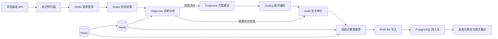

# MediGen

MediGen 是一套本机运行的临床辅助分析与医学教育工作台。系统接收合成或去标识化病例叙述，依次完成信息提取、诊断分析、方案建议、医学编码、安全审计、教育推荐、FHIR 写入和结果持久化，并在网页中展示各阶段结果与实际耗时。

分析结果供具备资质的专业人员复核。项目内置数据包括 10 个疾病图谱节点、10 组症状关系、15 个教育主题、33 条 ICD-10-CM 编码、9 组 DRG 映射和 10 条药物相互作用规则。

## 1. 项目定位与技术栈

### 1.1 项目定位

- **输入**：10～12000 字符的中文或英文病例叙述，包含症状、病史、手术史、家族史、社会史、现用药、过敏史、生命体征、查体、化验和已完成检查。
- **输出**：结构化病例、主要诊断与鉴别诊断、建议检查、治疗方案候选、药物安全提示、ICD-10/DRG 候选、安全审计、教育内容卡片、FHIR 写入结果和会话编号。
- **交互**：FastAPI 同源提供网页与 API；网页包含三个病例快速填入项、六个流程结果区、节点耗时和基础设施链路状态。
- **运行方式**：Uvicorn 在 Windows 宿主机运行；PostgreSQL、Neo4j、Redis 和 HAPI FHIR 由 Docker Compose 运行。

### 1.2 技术栈

| 层级 | 实现 |
|---|---|
| 前端 | 原生 HTML、CSS、JavaScript；FastAPI 静态文件与同源接口；无前端构建步骤 |
| API | Python 3.11+、FastAPI 0.139.2、Uvicorn 0.51.0 |
| Agent 编排 | LangGraph 1.2.9、Pydantic 2.13.4 |
| 模型调用 | DeepSeek 兼容 `/chat/completions` 接口、HTTPX、JSON Object 输出 |
| 医学知识图谱 | Neo4j 5.26 Community、Neo4j Python Driver 6.2、Cypher GraphRAG |
| 推荐 | Neo4j 主题召回、本地 JSONL 主题目录、`rule_v1` 规则排序、DeepSeek 分层内容生成 |
| 缓存与限流 | Redis 7；图谱查询缓存、教育正文缓存、按客户端 IP 固定窗口限流 |
| 数据持久化 | PostgreSQL 16、SQLAlchemy 2.0、JSONB 会话数据、只追加审计表 |
| FHIR | `fhir.resources` 8.3、FHIR R4 transaction Bundle、HAPI FHIR v8.10.0-3 |
| 输入保护 | Microsoft Presidio、spaCy `en_core_web_sm`、本地正则规则 |
| 部署 | PowerShell、Docker Desktop、Docker Compose、锁定的 Python 依赖 |

主要代码位于 [`python/src`](python/src)，本机入口为 [`python/src/api/main.py`](python/src/api/main.py)。

## 2. 多 Agent 框架与工作链路

### 2.1 工作链路



一次请求对应一个独立 `ClinicalState`。LangGraph 使用有限有向图，无检查点记忆和回退边；诊断阶段标记信息缺口后直接进入审计节点。每个 Agent 的运行时间写入 `stage_timings_seconds`，推荐、FHIR 和持久化耗时由 API 层追加到 `processing_timeline`。

### 2.2 Agent 职责

| Agent | 输入 | 核心职责 | 输出 |
|---|---|---|---|
| Intake | 原始病例叙述 | 调用 DeepSeek 提取并用 `PatientInfo` 校验结构 | `patient_info` |
| Diagnosis | 结构化病例、Neo4j 症状关系 | 形成主要诊断、鉴别诊断、证据、建议检查和信息缺口 | `diagnosis`、`needs_more_info` |
| Treatment | 病例与诊断结果 | 生成方案候选，合并本地药物相互作用与过敏规则 | `treatment_plan` |
| Coding | 诊断与方案 | 生成 ICD-10 候选，使用本地目录补全描述、类别和 DRG | `coding_result` |
| Audit | 前四阶段结构化结果 | 执行 Presidio 与本地规则扫描，形成审计轨迹 | `audit_result` |

教育推荐由 API 在 LangGraph 完成后调用。该模块读取诊断、编码、建议检查、方案用药、用户偏好和历史交互，通过 Neo4j 召回候选主题，再使用确定性规则排序并生成最多 3 张内容卡片。

### 2.3 请求结束后的数据链路

1. 推荐模块生成 `education_recommendations`。
2. `fhir.resources` 校验 Patient、Condition 和 MedicationRequest，组成 transaction Bundle 并提交 HAPI FHIR。
3. PostgreSQL 保存原始输入、五个 Agent 结果、推荐结果、图谱上下文和 FHIR 写入信息。
4. `audit_logs` 使用数据库触发器阻止更新和删除。
5. FastAPI 返回 `integration_trace` 与 `processing_timeline`，网页按六个阶段展示。

## 3. 模块实现原理与参数

### 3.1 分析接口

主接口：`POST /api/v1/clinical/analyze`

```json
{
  "patient_description": "一名 47 岁女性合成病例，发热、咳黄色痰，青霉素过敏，服用 amoxicillin 后皮疹加重。",
  "include_recommendations": true,
  "recommendation_top_k": 3,
  "user_preferences": {
    "preferred_categories": [
      "disease_basics",
      "test_explanation",
      "medication_safety"
    ],
    "excluded_categories": [],
    "preferred_depth": "standard",
    "preferred_format": "bullet_points",
    "max_reading_minutes": 5
  },
  "user_history_context": {
    "interactions": [
      {
        "topic_id": "pneumonia_basics",
        "event_type": "view",
        "occurred_at": "2026-07-22T12:00:00+08:00"
      }
    ]
  }
}
```

| 参数 | 类型与范围 | 默认值 | 作用 |
|---|---|---:|---|
| `patient_description` | 字符串，10～12000 字符 | 必填 | 病例叙述 |
| `include_recommendations` | 布尔值 | `true` | 控制教育推荐 |
| `recommendation_top_k` | 整数，1～3 | `3` | 返回卡片数量 |
| `preferred_categories` | 类别数组 | `[]` | 提高对应类别分值 |
| `excluded_categories` | 类别数组 | `[]` | 排除对应类别；强制安全主题保留 |
| `preferred_depth` | `beginner`、`standard` | 空 | 控制正文深度 |
| `preferred_format` | `brief`、`bullet_points`、`step_by_step`、`question_answer` | 空 | 调整主题排序 |
| `max_reading_minutes` | 整数，1～10 | 空 | 提高符合阅读时长的主题分值 |
| `interactions` | 最多 20 条 | `[]` | 使用浏览、收藏、有效、忽略和无效反馈 |
| `event_type` | `view`、`save`、`helpful`、`dismiss`、`not_helpful` | 必填 | 定义历史反馈类型 |

推荐类别包括：`disease_basics`、`test_explanation`、`medication_safety`、`lifestyle_education`、`follow_up_education`、`care_process`、`warning_signs`。

响应包含：

- `analysis_status`：`completed`、`needs_more_info` 或 `partial`；
- `patient_info`、`diagnosis`、`treatment_plan`、`coding_result`、`audit_result`；
- `education_recommendations`、`session_id`、`fhir_export`；
- `information_gaps`、`errors`、`warnings`；
- `integration_trace`、`processing_timeline`。

辅助接口：

| 方法 | 路径 | 参数 |
|---|---|---|
| `POST` | `/api/v1/clinical/icd10/search` | `query`，至少 2 个字符 |
| `GET` | `/api/v1/clinical/icd10/{code}` | ICD-10 编码 |
| `POST` | `/api/v1/clinical/ddi/check` | `new_drugs` 至少 1 项，`current_drugs` 可为空 |
| `GET` | `/health` | 进程存活检查 |
| `GET` | `/ready` | 模型配置、主题目录和五项运行依赖检查 |

### 3.2 DeepSeek 结构化调用

四个 Agent 与教育正文共用 [`deepseek_client.py`](python/src/services/deepseek_client.py)：

- 请求地址：`{DEEPSEEK_BASE_URL}/chat/completions`；
- `temperature=0`、`stream=false`、思考模式关闭、`response_format=json_object`；
- Pydantic 校验 JSON 字段、类型、枚举和数值范围；
- JSON 或模型结构异常时携带校验摘要发起一次修正请求；
- 鉴权错误返回 503，请求参数错误与上游故障返回 502。

| 环境变量 | 默认值 | 有效范围 |
|---|---:|---|
| `DEEPSEEK_TIMEOUT_SECONDS` | `90` | 大于 0 且不超过 300 秒 |
| `DEEPSEEK_MAX_RETRIES` | `1` | 0～2 次重试 |
| `DEEPSEEK_MAX_TOKENS` | `2048` | 256～8192 |
| 教育正文 `max_tokens` | `1800` | 模块固定值 |

### 3.3 流程模块

| 流程 | 实现原理 | 关键参数 | 主要结果 |
|---|---|---|---|
| 输入保护 | Presidio 英文实体识别与本地正则共同扫描邮箱、电话、证件、IP、病历号和带标签姓名；命中后返回 422 | Presidio 阈值 `0.65`；`PROTOTYPE_REJECT_OBVIOUS_PHI=true` | 标识符类别，不回传命中文本 |
| 请求限流 | Redis 按客户端 IP 维护 60 秒固定窗口计数 | `RATE_LIMIT_REQUESTS_PER_MINUTE=20` | 剩余请求数；超限返回 429 |
| 信息提取 | DeepSeek 输出 JSON，Pydantic 归一化年龄、性别、严重程度、药物、化验和检查字段；姓名固定为 `Unknown`，患者编号固定为空 | 输入 10～12000 字符 | 完整 `PatientInfo` |
| 诊断 GraphRAG | 从症状提取名称，以参数化 Cypher 查询 `Symptom-[:INDICATES]->Disease`，汇总关系权重和照护概念 | 图谱最多返回 8 个疾病；前 6 个写入模型上下文；Redis TTL 默认 1800 秒 | 诊断候选、置信度、证据路径、建议检查、信息缺口 |
| 方案与用药安全 | DeepSeek 生成方案候选；本地规则匹配新用药、现用药、药物类别、中文别名和过敏史 | 10 条 DDI 规则；青霉素与 amoxicillin/ampicillin 交叉过敏规则 | 药物、剂量文本、非药物措施、随访、相互作用和过敏警示 |
| 医学编码 | DeepSeek 生成 ICD-10-CM 候选；本地目录覆盖描述与类别，并按编码前三位匹配 DRG | 33 条 ICD-10-CM；9 组 DRG | 主要与次要编码、编码置信度、DRG、目录匹配状态 |
| 安全审计 | 序列化前四阶段结果后再次执行 Presidio 与本地规则扫描，并检查结构化分区覆盖 | 直接标识符扫描、分区数量 | `demo_safe`、`phi_fields_found`、`audit_trail`、风险标签 |
| 教育推荐 | 从诊断名称、ICD-10、建议检查和方案用药构建上下文；Neo4j 查询关联主题；规则排序后调用 DeepSeek 生成正文 | 15 个主题；返回 1～3 张；历史交互有效上限 20 | 主题、排序原因、分层正文、来源与安全提示 |
| FHIR 互操作 | 构建 Patient、临时诊断 Condition、方案性质 MedicationRequest，校验后提交 transaction Bundle | `FHIR_TIMEOUT_SECONDS=30` | Bundle 编号、资源类型、资源位置 |
| 会话持久化 | SQLAlchemy 事务写入 `clinical_sessions` 和只追加 `audit_logs` | 连接池 3，最大溢出 2，连接超时 3 秒 | 会话编号、会话数、审计数 |
| 网页展示 | 原生 JavaScript 渲染六个阶段、图谱证据、药物安全、FHIR、数据库状态和耗时 | 教育卡片 1～3 张 | 桌面与窄屏界面 |

### 3.4 推荐规则

候选主题首先匹配 ICD-10 前缀、诊断名称、建议检查和方案用药。排序分值如下：

| 信号 | 分值 |
|---|---:|
| 主题基础优先级 | `priority` |
| ICD-10 前缀匹配 | `+10` |
| 建议检查匹配 | `+6` |
| 诊断名称匹配 | `+5` |
| 药物安全主题与用药匹配 | `+3` |
| 偏好类别匹配 | `+3` |
| 曾认可同类主题且本主题未消费 | `+2` |
| 深度、格式、阅读时长分别匹配 | 每项 `+1` |
| 已浏览 | `-3` |
| 已收藏或标记有效 | `-2` |

排序规则：分值降序，分值相同时按 `topic_id` 升序。`dismiss` 和 `not_helpful` 主题进入排除集合；与诊断或检查强匹配的强制安全主题可越过偏好排除。审计结果标记直接标识符风险时，候选收敛为强制安全主题和通用主题。

正文生成参数：

- `beginner`：100～180 个中文字符，使用通俗表达并解释临床术语；
- `standard`：220～420 个中文字符，包含机制、解释边界和随访要点；
- Redis 使用主题编号、阅读深度和临床上下文计算缓存键；
- DeepSeek 生成异常时返回主题目录中的基础摘要。

### 3.5 核心运行参数

完整配置见 [`python/.env.example`](python/.env.example)。

| 参数 | 默认值 | 作用 |
|---|---:|---|
| `RECOMMENDATION_ENABLED` | `true` | 启用教育推荐 |
| `RECOMMENDATION_TOP_K` | `3` | 服务默认推荐数 |
| `MAX_HISTORY_INTERACTIONS` | `20` | 有效历史交互上限 |
| `RECOMMENDATION_GENERATE_CONTENT` | `true` | 启用 DeepSeek 教育正文生成 |
| `REDIS_CACHE_TTL_SECONDS` | `1800` | 图谱与正文缓存时长 |
| `INFRASTRUCTURE_REQUIRED` | `true` | 分析前要求本地依赖全部就绪 |
| `APP_PORT` | `8001` | 本机网页与 API 端口 |
| `REDIS_PORT` | `6380` | Redis 宿主机端口 |

## 4. 从零部署到本机运行

以下流程适用于 Windows PowerShell。

### 4.1 准备环境

安装并启动：

- Python 3.11 或更高版本；
- Docker Desktop，使用 Linux 容器；
- Git；
- JDK 17 或更高版本；
- 可访问 Python 包源、Docker 镜像源、Apache Maven、GitHub 和 DeepSeek 接口的网络。

首次构建 HAPI FHIR 时，脚本下载 Apache Maven 3.9.12，检出 HAPI FHIR JPA Starter `image/v8.10.0-3` 的固定提交，并生成 `medigen/hapi-fhir:v8.10.0-3` 镜像。

### 4.2 配置 DeepSeek

在项目根目录执行：

```powershell
Set-Location .\python
Copy-Item .env.example .env
notepad .env
```

至少填写：

```dotenv
LLM_BACKEND=deepseek
DEEPSEEK_API_KEY=你的密钥
DEEPSEEK_BASE_URL=https://api.deepseek.com
DEEPSEEK_MODEL=deepseek-v4-pro
```

兼容接口可通过 `DEEPSEEK_BASE_URL` 和 `DEEPSEEK_MODEL` 切换服务地址与模型名称。

### 4.3 一键部署

保持 Docker Desktop 运行，在 `python` 目录执行：

```powershell
.\scripts\deploy-local.ps1
```

脚本依次完成：

1. 创建 `.venv`；
2. 安装锁定的 Python 依赖和 `en_core_web_sm`；
3. 构建或复用 HAPI FHIR 本地镜像；
4. 启动 PostgreSQL、Neo4j、Redis 和 HAPI FHIR；
5. 等待四项 Docker 服务就绪；
6. 以隐藏进程启动 Uvicorn；
7. 等待 `/ready` 返回 `ready`。

### 4.4 检查服务

```powershell
$ready = Invoke-RestMethod http://127.0.0.1:8001/ready
$ready | ConvertTo-Json -Depth 5
```

就绪结果应包含：

```text
status: ready
deepseek_configured: true
recommendation_store_loaded: true
dependencies.postgresql: true
dependencies.neo4j: true
dependencies.redis: true
dependencies.fhir: true
dependencies.presidio: true
```

| 服务 | 地址 |
|---|---|
| 可视化工作台 | <http://127.0.0.1:8001/> |
| Swagger UI | <http://127.0.0.1:8001/docs> |
| 进程检查 | <http://127.0.0.1:8001/health> |
| 依赖检查 | <http://127.0.0.1:8001/ready> |
| Neo4j Browser | <http://127.0.0.1:7474/> |
| HAPI FHIR Metadata | <http://127.0.0.1:8080/fhir/metadata> |
| PostgreSQL | `localhost:5432` |
| Redis | `localhost:6380` |

### 4.5 网页操作

1. 打开 <http://127.0.0.1:8001/>。
2. 选择一个快速填入病例，或输入完整的合成病例叙述。
3. 选择教育类别、内容深度和卡片数量。
4. 点击“提交分析”。
5. 依次查看信息提取、诊断分析、方案建议、医学编码、安全审计和教育内容。
6. 在质量复核区查看 Presidio、Neo4j、Redis、PostgreSQL 和 HAPI FHIR 链路状态。

### 4.6 全链路检查

```powershell
.\scripts\demo-real.ps1 -Case all
```

| 病例 | 主要检查项 |
|---|---|
| 前壁心梗与用药核查 | `I21.0`、DRG `280`、warfarin–aspirin 相互作用 |
| 肺炎与过敏核查 | `J18.1`、DRG `193`、amoxicillin 与青霉素过敏风险 |
| 急性失代偿性心衰 | `I50.9`、DRG `291`、容量负荷相关证据 |

检查结果写入 `python/.runtime/real-validation-last.json`。

### 4.7 停止与重新启动

停止 Uvicorn：

```powershell
.\scripts\stop-local.ps1
```

停止 Docker 数据服务：

```powershell
docker compose stop
```

电脑重启或 Docker Desktop 重启后，在 `python` 目录执行：

```powershell
.\scripts\deploy-local.ps1 -SkipInstall
```

该命令复用 `.venv` 和已有镜像，启动数据服务并恢复网页与 API。数据保存在 `pgdata` 和 `neo4jdata` 命名卷中。

数据服务已经就绪时，可单独启动 Uvicorn：

```powershell
.\scripts\start-local.ps1
```

### 4.8 代码修改后的生效方式

| 修改范围 | 操作 |
|---|---|
| `python/src/web` 下的 HTML、CSS、JavaScript | 浏览器强制刷新 |
| Python API、Agent、服务或配置代码 | 执行 `stop-local.ps1`，再执行 `start-local.ps1` |
| Docker Compose、HAPI FHIR 镜像或 Dockerfile | 重新创建对应容器或镜像 |

前端文件由 FastAPI 直接提供，网页修改不需要 Node.js、npm 或前端镜像构建。

### 4.9 常用排查命令

```powershell
docker compose ps
docker compose logs --tail 100 postgres neo4j redis fhir
Get-Content .\.runtime\uvicorn-8001.stderr.log -Tail 100
Invoke-RestMethod http://127.0.0.1:8001/ready | ConvertTo-Json -Depth 5
```
