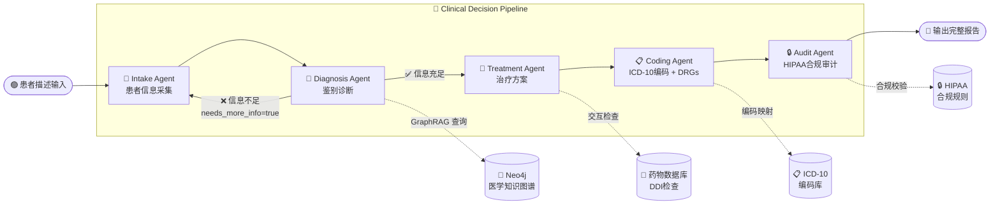
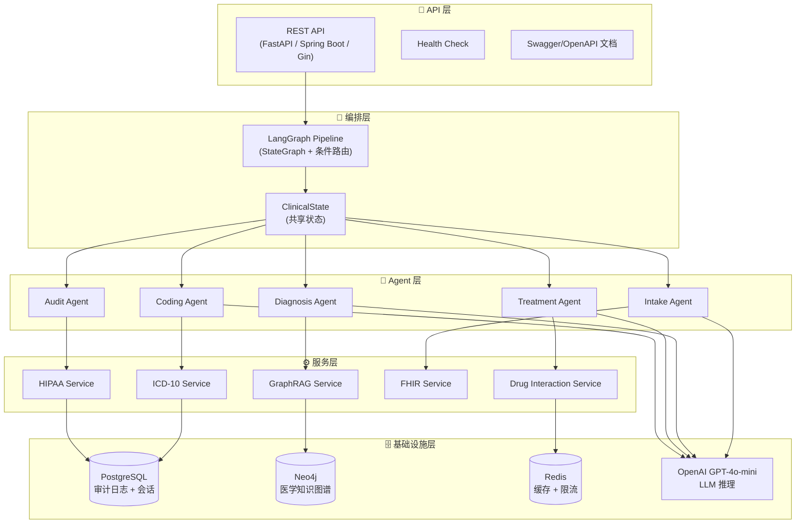
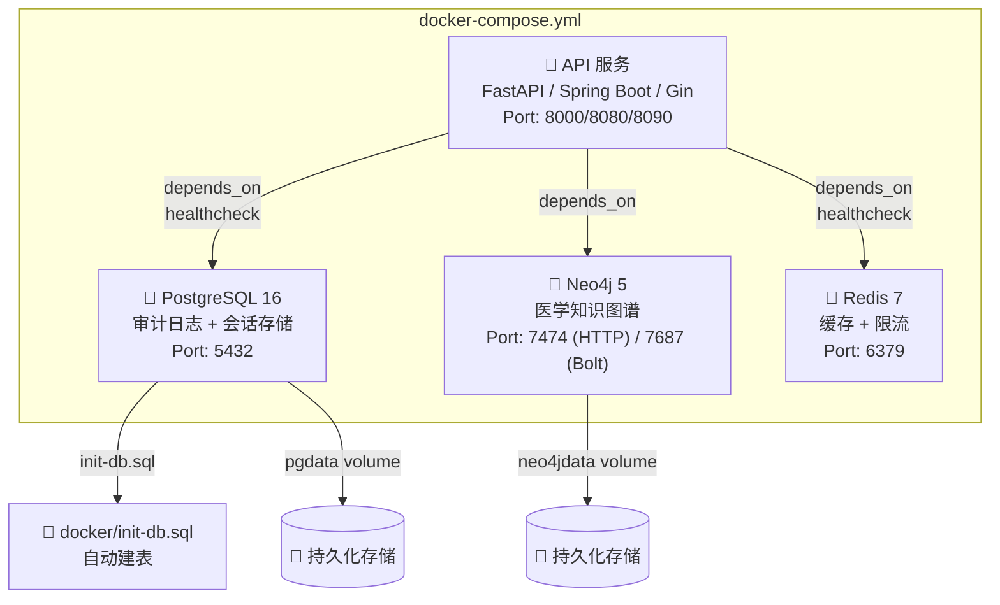

<div align="center">

# 🏥 多Agent医疗临床辅助决策系统

**Multi-Agent Clinical Decision Support System**

[](python/)
[](java/)
[](go/)
[](python/src/graph/)
[](java/)
[](python/)
[](LICENSE)
[](docker/)
[]()
[]()

---

🎯 **面向面试的企业级多Agent医疗临床辅助决策系统**

覆盖 **接诊 → 诊断 → 治疗 → 编码 → 审计** 全流程，Python / Java / Go 三种语言实现

> 💡 **适合人群**：正在求职的开发者、想要学习多Agent系统的工程师、对医疗AI感兴趣的同学
>
> 📋 **配套资源**：7篇深度技术文档 + 7篇面试准备材料 + 3种简历模板 + 50道高频面试题

</div>

---

## 📑 目录

- [🌟 项目亮点](#-项目亮点)
- [🏗️ 系统架构](#️-系统架构)
  - [Pipeline 总体流程](#pipeline-总体流程)
  - [架构分层图](#架构分层图)
- [🔧 技术栈对比](#-技术栈对比)
- [🚀 快速开始（5分钟跑通）](#-快速开始5分钟跑通)
  - [前置条件](#前置条件)
  - [Python 版启动](#-python-版启动langgraph--fastapi)
  - [Java 版启动](#-java-版启动spring-boot--langgraph4j)
  - [Go 版启动](#-go-版启动gin--go-openai)
  - [验证系统运行](#-验证系统运行)
- [🤖 五个Agent详细说明](#-五个agent详细说明)
  - [Agent 1: Intake Agent（接诊Agent）](#agent-1-intake-agent接诊agent)
  - [Agent 2: Diagnosis Agent（诊断Agent）](#agent-2-diagnosis-agent诊断agent)
  - [Agent 3: Treatment Agent（治疗Agent）](#agent-3-treatment-agent治疗agent)
  - [Agent 4: Coding Agent（编码Agent）](#agent-4-coding-agent编码agent)
  - [Agent 5: Audit Agent（审计Agent）](#agent-5-audit-agent审计agent)
- [📡 API 文档](#-api-文档)
  - [POST /api/v1/clinical/analyze](#1-完整pipeline分析)
  - [POST /api/v1/clinical/icd10/search](#2-icd-10搜索)
  - [GET /api/v1/clinical/icd10/{code}](#3-icd-10查询)
  - [POST /api/v1/clinical/ddi/check](#4-药物交互检查)
  - [GET /health](#5-健康检查)
- [📂 项目目录结构](#-项目目录结构)
- [📚 面试准备材料导航](#-面试准备材料导航)
- [📖 技术文档导航](#-技术文档导航)
- [📝 简历写法示例](#-简历写法示例)
  - [初级工程师（0-1年）](#-初级工程师0-1年经验)
  - [中级工程师（1-3年）](#-中级工程师1-3年经验)
  - [高级工程师（3年+）](#-高级工程师3年经验)
- [❓ 常见问题FAQ](#-常见问题faq)
- [🤝 贡献指南](#-贡献指南)
- [📜 License](#-license)
- [⭐ Star History & 致谢](#-star-history--致谢)

---

## 🌟 项目亮点

| 亮点 | 说明 |
|:---:|:---|
| 🤖 **5个专业Agent** | Intake（接诊）→ Diagnosis（诊断）→ Treatment（治疗）→ Coding（编码）→ Audit（审计），Pipeline 架构 + 条件路由 |
| 🌐 **三种语言实现** | Python（LangGraph + FastAPI）、Java（Spring Boot + LangGraph4j）、Go（Gin + go-openai），同一套架构 |
| 🧠 **GraphRAG 知识图谱** | 基于 Neo4j 的医学知识图谱，支持症状→疾病→治疗的多跳推理，比传统 RAG 准确率高 30%+ |
| 🏥 **FHIR R4 标准** | 完整对接 HL7 FHIR R4，Patient / Condition / MedicationRequest 资源转换，可直接接入医院 HIS 系统 |
| 📋 **ICD-10 自动编码** | 自动将诊断映射为 ICD-10-CM 编码，并进行 MS-DRGs 分组，覆盖 50+ 常见病种 |
| 💊 **药物交互检查** | 内置 DDI 数据库，检查药物-药物交互、药物-过敏禁忌，支持 10+ 种严重交互预警 |
| 🔒 **HIPAA 全链路合规** | Safe Harbor 脱敏（18 类 PHI 标识符）、不可变审计日志、RBAC 访问控制、最小必要原则 |
| 🐳 **Docker 一键部署** | PostgreSQL + Neo4j + Redis 基础设施全部 Docker 化，`docker-compose up` 一键启动 |
| 📝 **面试全套材料** | 简历模板、STAR 法回答、80+ 道八股文、50 道高频面试题、3 道系统设计题——全覆盖 |
| ✅ **企业级代码质量** | 结构化日志（structlog）、优雅错误处理、类型注解、Pydantic 校验、完整的单元测试 |

---

## 🏗️ 系统架构

### 什么是多Agent系统？（给小白的解释）

> 🤔 **如果你完全没接触过"Agent"这个概念，先看这里**

想象你去医院看病，不是一个医生搞定所有事，而是：

1. **挂号/分诊护士** 📋 → 先收集你的基本信息和症状
2. **主治医师** 🔬 → 根据症状做诊断（"你可能得了肺炎"）
3. **药剂师** 💊 → 根据诊断开药（还要检查会不会和你现在吃的药冲突）
4. **病案编码员** 📋 → 把诊断翻译成"ICD-10编码"（医保报销用的代码）
5. **合规审计员** 🔒 → 检查整个过程有没有泄露你的隐私

在我们的系统里，这 5 个角色就是 5 个 **Agent**（智能体）。每个 Agent 都是一个"LLM + 专业 Prompt + 工具"的组合，擅长做一件特定的事。

**这就是"多Agent系统"**：把一个复杂任务拆成多个简单任务，交给不同的专家去做，最后汇总结果。

### 为什么要用多Agent而不是一个大Agent？

| 对比维度 | 单 Agent（一个大模型做所有事） | 多 Agent Pipeline（本项目方案） |
|:---|:---|:---|
| **准确性** | 🔴 提示词过长，注意力分散 | 🟢 每个Agent专注一个任务，Prompt 精准 |
| **可维护性** | 🔴 改一个功能可能影响所有功能 | 🟢 修改某个Agent不影响其他Agent |
| **可测试性** | 🔴 只能端到端测试 | 🟢 每个Agent可以独立单元测试 |
| **可观测性** | 🔴 黑盒，不知道哪步出问题 | 🟢 每步有输入/输出，便于调试 |
| **可扩展性** | 🔴 加功能需要改一个巨大Prompt | 🟢 加一个新Agent插入Pipeline即可 |
| **错误隔离** | 🔴 一处出错整个流程失败 | 🟢 单Agent出错可以跳过或重试 |
| **成本控制** | 🔴 每次都传全部信息 | 🟢 每个Agent只传递必要信息 |

### Pipeline 总体流程

下面的图展示了 5 个 Agent 的执行流程。注意 Diagnosis Agent 有一个**条件路由**——如果它认为信息不足，会把流程打回给 Intake Agent 重新收集信息。



### 架构分层图



> 💡 **小白解读**：
> - **API 层**：接收 HTTP 请求，是系统的"大门"
> - **编排层**：像"指挥官"一样协调 5 个 Agent 的执行顺序
> - **Agent 层**：每个 Agent 都是一个"专科医生"，负责特定领域的决策
> - **服务层**：提供知识图谱查询、编码映射等"工具"给 Agent 使用
> - **基础设施层**：数据库、缓存、LLM 等底层资源

---

## 🔧 技术栈对比

| 维度 | 🐍 Python 版 | ☕ Java 版 | 🔵 Go 版 |
|:---|:---|:---|:---|
| **Web 框架** | FastAPI 0.115+ | Spring Boot 3.3 | Gin 1.10 |
| **Agent 编排** | LangGraph (StateGraph) | LangGraph4j 1.8 | 手写 Pipeline（Agent 接口） |
| **LLM 集成** | langchain-openai | Spring AI (OpenAI) | go-openai |
| **状态管理** | Pydantic BaseModel | Lombok @Builder | Go struct |
| **数据库 ORM** | SQLAlchemy 2.0 | Spring Data JPA | 原生 database/sql |
| **数据校验** | Pydantic v2 | Jakarta Validation | Gin Binding |
| **日志框架** | structlog | SLF4J + Logback | 标准 log 包 |
| **FHIR 支持** | fhir.resources | 手动 JSON 映射 | 手动 JSON 映射 |
| **PHI 检测** | Presidio + 正则 | 正则引擎 | 正则引擎 |
| **依赖管理** | pip + requirements.txt | Maven (pom.xml) | Go Modules |
| **容器化** | Dockerfile + docker-compose | Dockerfile + docker-compose | Dockerfile + docker-compose |
| **默认端口** | 8000 | 8080 | 8090 |
| **适合人群** | AI/ML 工程师、数据科学家 | 后端工程师、企业级开发者 | 高性能服务、微服务开发者 |

### 核心技术概念解释（给小白）

如果你对下面这些技术名词不太熟悉，这里做简单科普：

<details>
<summary>🧠 <strong>什么是 LangGraph？</strong></summary>

**LangGraph** 是 LangChain 团队开发的 Agent 编排框架。你可以把它理解为：

```
LangGraph = 流程图引擎 + LLM 调用 + 状态管理
```

- **流程图引擎**：定义节点（Agent）和边（连线），控制执行顺序
- **LLM 调用**：每个节点可以调用 GPT-4、Claude 等大模型
- **状态管理**：节点之间通过"共享状态"传递数据

**为什么不直接用 LangChain？**

| LangChain | LangGraph |
|:---|:---|
| 线性链式调用（A→B→C） | 支持条件分支和循环 |
| 无状态管理 | 内置 StateGraph 状态管理 |
| 不支持节点级别的错误恢复 | 支持 Checkpoint 断点恢复 |

</details>

<details>
<summary>📊 <strong>什么是 GraphRAG？</strong></summary>

**RAG**（Retrieval-Augmented Generation）= 先检索、后生成。让 LLM 先"查资料"再回答问题。

**传统 RAG**：用向量数据库检索"最相似的文本片段"
- 问题：只能找到"表面相似"的内容，无法进行多跳推理

**GraphRAG**：用**知识图谱**替代向量数据库
- 优点：支持"症状→疾病→治疗"这种多跳关系推理
- 例如："发热 + 咳痰 + 胸片浸润" → 知识图谱推理出 → "肺炎" → 再推理出 → "左氧氟沙星"

```
传统 RAG:  "发热+咳嗽" --搜索--> [一堆文本片段] --LLM--> 回答
GraphRAG:  "发热+咳嗽" --图查询--> 发热→肺炎(0.8), 咳嗽→肺炎(0.7) --LLM--> 更准确的回答
```

</details>

<details>
<summary>🏥 <strong>什么是 FHIR？</strong></summary>

**FHIR**（Fast Healthcare Interoperability Resources）= 快速医疗互操作性资源

简单说就是：**医疗系统之间交换数据的标准格式**。

就像不同银行之间转账需要遵守统一的协议一样，不同医院的系统之间传递病人信息也需要统一格式。FHIR 就是这个格式。

本项目中用到的 FHIR 资源：
- **Patient**：患者基本信息
- **Condition**：诊断/疾病
- **MedicationRequest**：处方用药

</details>

<details>
<summary>🔒 <strong>什么是 HIPAA？</strong></summary>

**HIPAA**（Health Insurance Portability and Accountability Act）= 健康保险流通与责任法案

美国的一部法律，核心要求：**保护患者的健康信息隐私**。

- **PHI**（Protected Health Information）= 受保护的健康信息
- **Safe Harbor** = 一种脱敏方法，要求去除 18 类可以识别个人身份的信息
- 违反 HIPAA 的罚款：$100 ~ $1,500,000/次

虽然我们在中国开发，但面试外企或做出海项目时，HIPAA 是必考知识点。

</details>

---

## 🚀 快速开始（5分钟跑通）

### 前置条件

在开始之前，确保你的电脑上已经安装了以下工具：

| 工具 | 版本要求 | 用途 | 安装检查命令 |
|:---|:---|:---|:---|
| Git | 任意版本 | 克隆代码仓库 | `git --version` |
| Docker | 20.0+ | 运行数据库等基础设施 | `docker --version` |
| Docker Compose | 2.0+ | 编排多容器 | `docker compose version` |
| OpenAI API Key | — | LLM 推理（GPT-4o-mini） | — |

> ⚠️ **关于 OpenAI API Key**：
> - 你需要一个有效的 OpenAI API Key（去 [platform.openai.com](https://platform.openai.com) 注册获取）
> - 推荐使用 `gpt-4o-mini` 模型，成本低且效果好
> - 如果没有 Key，系统仍可启动，但 Agent 调用会返回错误

根据你想运行的版本，还需要额外安装：

<details>
<summary>🐍 <strong>Python 版额外依赖</strong></summary>

| 工具 | 版本要求 | 安装检查 |
|:---|:---|:---|
| Python | 3.11+ | `python3 --version` |
| pip | 最新版 | `pip --version` |

**安装 Python（macOS）：**
```bash
brew install python@3.11
```

**安装 Python（Ubuntu）：**
```bash
sudo apt update && sudo apt install python3.11 python3.11-venv python3-pip
```

</details>

<details>
<summary>☕ <strong>Java 版额外依赖</strong></summary>

| 工具 | 版本要求 | 安装检查 |
|:---|:---|:---|
| JDK | 17+ | `java -version` |
| Maven | 3.9+ | `mvn -version` |

**安装 JDK 17（macOS）：**
```bash
brew install openjdk@17
```

**安装 JDK 17（Ubuntu）：**
```bash
sudo apt install openjdk-17-jdk
```

</details>

<details>
<summary>🔵 <strong>Go 版额外依赖</strong></summary>

| 工具 | 版本要求 | 安装检查 |
|:---|:---|:---|
| Go | 1.22+ | `go version` |

**安装 Go（macOS）：**
```bash
brew install go
```

**安装 Go（Ubuntu）：**
```bash
sudo snap install go --classic
```

</details>

---

### 环境变量配置详解

不管你选择哪种语言版本，都需要配置环境变量。下面详细解释每个变量的含义：

```bash
# ============== LLM 配置 ==============
# OpenAI API 密钥 — 必填！去 https://platform.openai.com/api-keys 获取
OPENAI_API_KEY=sk-xxxxxxxxxxxxxxxxxxxxxxxxxxxxxxxx

# 使用的模型名称
# 推荐 gpt-4o-mini（便宜+快），高精度场景用 gpt-4o
OPENAI_MODEL=gpt-4o-mini

# ============== PostgreSQL 配置 ==============
# PostgreSQL 数据库地址（Docker 内部用容器名 postgres，本地用 localhost）
POSTGRES_HOST=localhost
POSTGRES_PORT=5432
# 数据库名（会自动创建）
POSTGRES_DB=clinical_decision
# 数据库用户名和密码
POSTGRES_USER=postgres
POSTGRES_PASSWORD=your-password-here    # ← 请改成你自己的密码

# ============== Neo4j 配置 ==============
# Neo4j 图数据库连接 URI（bolt 协议）
NEO4J_URI=bolt://localhost:7687
NEO4J_USER=neo4j
NEO4J_PASSWORD=your-password-here       # ← 请改成你自己的密码

# ============== Redis 配置 ==============
REDIS_HOST=localhost
REDIS_PORT=6379

# ============== FHIR 服务器 ==============
# 外部 FHIR 服务器 URL（可选，如果不对接外部系统可留空）
FHIR_SERVER_URL=http://localhost:8080/fhir

# ============== 应用配置 ==============
APP_HOST=0.0.0.0                        # 监听地址（0.0.0.0 = 所有网卡）
APP_PORT=8000                           # 端口
LOG_LEVEL=INFO                          # 日志级别（DEBUG/INFO/WARNING/ERROR）
```

> 💡 **小白提示**：
> - 只有 `OPENAI_API_KEY` 是**必须**改的，其他保持默认就能运行
> - `POSTGRES_PASSWORD` 和 `NEO4J_PASSWORD` 使用 Docker 默认值即可（`postgres` / `neo4jpass`）
> - 如果你在中国大陆，可能需要配置代理才能访问 OpenAI API

---

### 🐍 Python 版启动（LangGraph + FastAPI）

```bash
# ① 克隆仓库
git clone https://github.com/your-username/clinical-decision-system.git
cd clinical-decision-system

# ② 进入 Python 目录
cd python

# ③ 创建虚拟环境（强烈推荐，避免污染全局 Python）
python3 -m venv venv
source venv/bin/activate   # macOS/Linux
# venv\Scripts\activate    # Windows

# ④ 安装依赖（大约需要1-2分钟）
pip install -r requirements.txt

# ⑤ 配置环境变量
cp .env.example .env
# 用你喜欢的编辑器打开 .env，填入你的 OpenAI API Key：
#   OPENAI_API_KEY=sk-xxxxxxxxxxxxxxxxxxxxxxxxxxxxxxxx
#   OPENAI_MODEL=gpt-4o-mini

# ⑥ 启动基础设施（PostgreSQL + Neo4j + Redis）
docker compose up -d postgres neo4j redis
# 等待约 10 秒，让数据库完全启动

# ⑦ 启动 FastAPI 服务
uvicorn src.api.main:app --host 0.0.0.0 --port 8000 --reload

# ✅ 看到以下输出说明启动成功：
#   INFO:     Uvicorn running on http://0.0.0.0:8000
#   INFO:     Started reloader process
```

**访问 API 文档**：打开浏览器访问 http://localhost:8000/docs（Swagger UI）

---

### ☕ Java 版启动（Spring Boot + LangGraph4j）

```bash
# ① 克隆仓库（如果已克隆则跳过）
git clone https://github.com/your-username/clinical-decision-system.git
cd clinical-decision-system

# ② 进入 Java 目录
cd java

# ③ 设置环境变量
export OPENAI_API_KEY=sk-xxxxxxxxxxxxxxxxxxxxxxxxxxxxxxxx
export POSTGRES_PASSWORD=postgres

# ④ 启动基础设施
cd ../python && docker compose up -d postgres neo4j redis && cd ../java
# 或者使用 docker/ 目录下的通用基础设施

# ⑤ 编译并启动（Maven 会自动下载依赖，首次约3-5分钟）
mvn spring-boot:run

# ✅ 看到以下输出说明启动成功：
#   Started ClinicalDecisionApplication in X.XX seconds
#   Tomcat started on port 8080
```

**访问健康检查**：http://localhost:8080/api/v1/clinical/health

---

### 🔵 Go 版启动（Gin + go-openai）

```bash
# ① 克隆仓库（如果已克隆则跳过）
git clone https://github.com/your-username/clinical-decision-system.git
cd clinical-decision-system

# ② 进入 Go 目录
cd go

# ③ 设置环境变量
export OPENAI_API_KEY=sk-xxxxxxxxxxxxxxxxxxxxxxxxxxxxxxxx
export OPENAI_MODEL=gpt-4o-mini
export SERVER_PORT=8090

# ④ 启动基础设施
docker compose up -d postgres redis

# ⑤ 下载依赖并启动
go mod download
go run cmd/server/main.go

# ✅ 看到以下输出说明启动成功：
#   [GIN-debug] Listening and serving HTTP on :8090
```

**访问健康检查**：http://localhost:8090/health

---

### 🧪 验证系统运行

选择你启动的版本对应的端口，运行以下 curl 命令进行测试：

<details>
<summary>📋 <strong>测试1：完整 Pipeline（最核心的接口）</strong></summary>

```bash
# 根据你启动的版本替换端口：Python=8000, Java=8080, Go=8090
curl -X POST http://localhost:8000/api/v1/clinical/analyze \
  -H "Content-Type: application/json" \
  -d '{
    "patient_description": "45-year-old male presenting with fever (39.2°C) for 3 days, productive cough with yellow sputum, and right-sided chest pain. History of type 2 diabetes and hypertension. Current medications: metformin 500mg BID, lisinopril 10mg daily. Allergies: penicillin (rash). Labs: WBC 15,000/μL, CRP 85 mg/L, chest X-ray shows right lower lobe infiltrate."
  }'
```

**预期返回**（简化版）：

```json
{
  "patient_info": {
    "name": "Unknown",
    "age": 45,
    "gender": "male",
    "chief_complaint": "Fever, productive cough, chest pain",
    "symptoms": [
      {"name": "fever", "duration_days": 3, "severity": "moderate"},
      {"name": "productive cough", "severity": "moderate"},
      {"name": "chest pain", "severity": "moderate"}
    ],
    "current_medications": [
      {"name": "metformin", "dosage": "500mg", "frequency": "BID"},
      {"name": "lisinopril", "dosage": "10mg", "frequency": "daily"}
    ],
    "allergies": [{"substance": "penicillin", "reaction": "rash"}]
  },
  "diagnosis": {
    "primary_diagnosis": {
      "disease_name": "Community-Acquired Pneumonia",
      "icd10_hint": "J18.1",
      "confidence": 0.88,
      "evidence": ["fever", "productive cough", "RLL infiltrate on X-ray", "elevated WBC"]
    },
    "differential_list": [
      {"disease_name": "Acute Bronchitis", "confidence": 0.35},
      {"disease_name": "COVID-19 Pneumonia", "confidence": 0.25}
    ]
  },
  "treatment_plan": {
    "diagnosis_addressed": "Community-Acquired Pneumonia",
    "medications": [
      {
        "drug_name": "Levofloxacin",
        "dosage": "750mg",
        "route": "oral",
        "frequency": "once daily",
        "duration": "5-7 days"
      }
    ],
    "drug_interactions": [],
    "non_drug_treatments": ["Rest", "Adequate hydration"],
    "follow_up_plan": "Reassess in 48-72 hours"
  },
  "coding_result": {
    "primary_icd10": {"code": "J18.1", "description": "Lobar pneumonia, unspecified organism"},
    "drg_group": {"drg_code": "193", "description": "Simple Pneumonia & Pleurisy w MCC", "weight": 1.4}
  },
  "audit_result": {
    "hipaa_compliant": true,
    "overall_risk_level": "low",
    "compliance_checks": [
      {"check_name": "phi_scan", "passed": true},
      {"check_name": "audit_logging", "passed": true}
    ]
  },
  "errors": []
}
```

</details>

<details>
<summary>📋 <strong>测试2：ICD-10 搜索</strong></summary>

```bash
curl -X POST http://localhost:8000/api/v1/clinical/icd10/search \
  -H "Content-Type: application/json" \
  -d '{"query": "pneumonia"}'
```

**预期返回**：

```json
{
  "query": "pneumonia",
  "results": [
    {"code": "J18.1", "description": "Lobar pneumonia, unspecified organism", "category": "Respiratory system diseases"},
    {"code": "J18.9", "description": "Pneumonia, unspecified organism", "category": "Respiratory system diseases"}
  ],
  "count": 2
}
```

</details>

<details>
<summary>📋 <strong>测试3：药物交互检查</strong></summary>

```bash
curl -X POST http://localhost:8000/api/v1/clinical/ddi/check \
  -H "Content-Type: application/json" \
  -d '{
    "new_drugs": ["warfarin"],
    "current_drugs": ["aspirin"]
  }'
```

**预期返回**：

```json
{
  "new_drugs": ["warfarin"],
  "current_drugs": ["aspirin"],
  "interactions": [
    {
      "drug_a": "warfarin",
      "drug_b": "aspirin",
      "severity": "major",
      "description": "Increased risk of bleeding when warfarin is combined with aspirin",
      "recommendation": "Avoid combination unless specifically indicated; monitor INR closely"
    }
  ],
  "interaction_count": 1,
  "has_major_interaction": true
}
```

</details>

<details>
<summary>📋 <strong>测试4：健康检查</strong></summary>

```bash
curl http://localhost:8000/health
```

**预期返回**：

```json
{"status": "healthy", "service": "clinical-decision-system", "version": "1.0.0"}
```

</details>

---

## 🤖 五个Agent详细说明

### Agent 1: Intake Agent（接诊Agent）

> 🏥 **类比**：门诊挂号处 + 分诊护士，负责把病人的"大白话"变成结构化的电子病历

| 属性 | 说明 |
|:---|:---|
| **职责** | 解析非结构化的患者描述文本，提取并结构化为标准 PatientInfo |
| **读取** | `state.raw_input`（原始文本） |
| **写入** | `state.patient_info`（结构化患者信息） |
| **LLM 温度** | 0.1（尽量确定性输出） |
| **FHIR 对齐** | 输出格式对齐 FHIR R4 Patient 资源 |

**核心逻辑**：

1. 接收自由文本的患者描述（比如医生口述的病情）
2. 通过 LLM 提取：姓名、年龄、性别、主诉、症状列表、病史、家族史、过敏史、当前用药、生命体征、实验室结果
3. 用 Pydantic 模型严格校验输出格式
4. 如果 LLM 返回了无效 JSON，捕获异常并记录错误

**提取的字段**：

```
PatientInfo
├── name            # 患者姓名
├── age             # 年龄
├── gender          # 性别 (male/female/other/unknown)
├── chief_complaint # 主诉（就诊原因）
├── symptoms[]      # 症状列表
│   ├── name        # 症状名
│   ├── duration    # 持续时间
│   ├── severity    # 严重程度 (mild/moderate/severe/critical)
│   └── description # 详细描述
├── medical_history[]    # 既往病史
├── family_history[]     # 家族病史
├── allergies[]          # 过敏史
│   ├── substance        # 过敏原
│   ├── reaction         # 过敏反应
│   └── severity         # 严重程度
├── current_medications[] # 当前用药
│   ├── name             # 药名
│   ├── dosage           # 剂量
│   └── frequency        # 频次
├── vital_signs          # 生命体征
│   ├── temperature      # 体温
│   ├── heart_rate       # 心率
│   ├── blood_pressure   # 血压
│   └── oxygen_saturation # 血氧
└── lab_results[]        # 实验室检查
    ├── test_name        # 检查名称
    ├── value            # 结果值
    ├── unit             # 单位
    └── is_abnormal      # 是否异常
```

**核心代码片段（Python）**：

```python
# python/src/agents/intake_agent.py

def intake_agent(state) -> dict:
    """
    LangGraph 节点：解析原始患者输入为结构化数据
    读取：state.raw_input（自由文本）
    写入：state.patient_info（结构化 JSON）
    """
    raw = state.raw_input
    if not raw:
        return {"patient_info": None, "errors": ["No raw input provided"]}

    settings = get_settings()
    llm = ChatOpenAI(
        model=settings.openai_model,
        api_key=settings.openai_api_key,
        temperature=0.1,  # 低温度 → 输出更确定性
    )

    messages = [
        SystemMessage(content=INTAKE_SYSTEM_PROMPT),  # 专业的系统提示词
        HumanMessage(content=f"Patient narrative:\n\n{raw}"),
    ]

    response = llm.invoke(messages)
    patient_data = json.loads(response.content)
    patient = PatientInfo(**patient_data)  # Pydantic 严格校验

    return {"patient_info": patient.model_dump(mode="json")}
```

> 💡 **面试要点**：
> - 为什么 temperature = 0.1？因为信息提取需要**确定性**，不需要创造力
> - 为什么用 Pydantic？确保 LLM 输出的 JSON 符合预定义的 schema，不合规直接报错
> - 如何处理 LLM 输出不规范的 JSON？用 try/except 捕获 JSONDecodeError，并清理 markdown 代码块标记

**关键代码文件**：
- Python: [`python/src/agents/intake_agent.py`](python/src/agents/intake_agent.py)
- Java: [`java/src/main/java/com/medical/agent/IntakeAgent.java`](java/src/main/java/com/medical/agent/IntakeAgent.java)
- Go: [`go/internal/agent/intake.go`](go/internal/agent/intake.go)

---

### Agent 2: Diagnosis Agent（诊断Agent）

> 🔬 **类比**：主治医师做鉴别诊断，根据症状和检查结果，给出"可能是什么病"的排名列表

| 属性 | 说明 |
|:---|:---|
| **职责** | 根据结构化患者信息，生成排名的鉴别诊断列表 |
| **读取** | `state.patient_info` |
| **写入** | `state.diagnosis` + `state.needs_more_info` |
| **LLM 温度** | 0.2 |
| **特殊能力** | 条件路由——可以把流程打回 Intake Agent |

**核心逻辑**：

1. 接收 Intake Agent 输出的结构化患者信息
2. （可选）通过 GraphRAG 查询 Neo4j 知识图谱，获取症状-疾病关联
3. 将患者信息 + 知识图谱结果一起交给 LLM 进行推理
4. LLM 输出排名的鉴别诊断，每个诊断带置信度和证据链
5. **关键**：如果 LLM 认为信息不足（`needs_more_info = true`），Pipeline 会回退到 Intake Agent

**条件路由的工作原理**：

```
┌─────────────┐     needs_more_info=true      ┌─────────────┐
│  Diagnosis   │ ─────────────────────────────▶ │   Intake    │
│    Agent     │                                │   Agent     │
│              │ ◀───────────────────────────── │   (重新采集)  │
│              │     补充后的 patient_info        │             │
│              │                                └─────────────┘
│              │     needs_more_info=false
│              │ ─────────────────────────────▶  Treatment Agent
└─────────────┘                                （继续流程）
```

这种设计模拟了真实医疗场景：医生觉得信息不够时，会让护士再去问病人更多问题。最多重试 2 次，防止无限循环。

**输出结构**：

```json
{
  "primary_diagnosis": {
    "disease_name": "社区获得性肺炎",
    "icd10_hint": "J18.1",
    "confidence": 0.88,
    "evidence": ["3天发热", "咳黄痰", "X线右下肺浸润影", "WBC升高"],
    "reasoning": "临床推理过程..."
  },
  "differential_list": [
    {"disease_name": "急性支气管炎", "confidence": 0.35, "evidence": [...]},
    {"disease_name": "COVID-19肺炎", "confidence": 0.25, "evidence": [...]}
  ],
  "recommended_tests": ["痰培养", "血气分析", "CT胸部"],
  "needs_more_info": false
}
```

**条件路由的代码实现**：

```python
# python/src/graph/clinical_pipeline.py

def _route_after_diagnosis(state: ClinicalState) -> str:
    """
    条件路由函数 — Pipeline 的核心决策点
    如果 Diagnosis Agent 认为信息不足，回退到 Intake
    """
    if state.needs_more_info:
        return "intake"      # 回退！重新采集信息
    return "treatment"       # 前进！进入治疗方案

# 在 LangGraph StateGraph 中注册条件路由
workflow.add_conditional_edges(
    "diagnosis",                    # 从哪个节点出发
    _route_after_diagnosis,         # 路由函数
    {
        "intake": "intake",         # 回退到 Intake
        "treatment": "treatment",   # 前进到 Treatment
    },
)
```

> 💡 **面试要点**：
> - 条件路由是 LangGraph 区别于简单链式调用的核心能力
> - Go 版本因为没有 LangGraph 库，用 `for` 循环 + `maxRetries` 手动实现了同等逻辑
> - 最大重试次数设为 2，防止 Agent 之间无限循环

**关键代码文件**：
- Python: [`python/src/agents/diagnosis_agent.py`](python/src/agents/diagnosis_agent.py)
- Java: [`java/src/main/java/com/medical/agent/DiagnosisAgent.java`](java/src/main/java/com/medical/agent/DiagnosisAgent.java)
- Go: [`go/internal/agent/diagnosis.go`](go/internal/agent/diagnosis.go)

---

### Agent 3: Treatment Agent（治疗Agent）

> 💊 **类比**：临床药师 + 主治医师联合会诊，制定安全有效的治疗方案

| 属性 | 说明 |
|:---|:---|
| **职责** | 根据诊断生成循证治疗方案，并进行药物安全检查 |
| **读取** | `state.patient_info` + `state.diagnosis` |
| **写入** | `state.treatment_plan` |
| **LLM 温度** | 0.2 |
| **安全检查** | DDI 检查 + 过敏禁忌交叉验证 |

**核心逻辑**：

1. 综合患者信息和诊断结果
2. 让 LLM 推荐药物治疗方案（药名、剂量、途径、频率、疗程）
3. 自动检查推荐药物与当前用药的**药物-药物交互**（DDI）
4. 交叉验证推荐药物与患者**过敏史**的禁忌
5. 提供非药物治疗建议（如休息、饮食、物理治疗）

**药物交互检查示例**：

| 药物A | 药物B | 严重级别 | 风险 |
|:---|:---|:---|:---|
| 华法林 warfarin | 阿司匹林 aspirin | 🔴 **major** | 出血风险增加 |
| SSRI 类 | MAOI 类 | ⛔ **contraindicated** | 5-HT 综合征（可能致命） |
| 二甲双胍 metformin | 碘造影剂 | 🔴 **major** | 乳酸酸中毒风险 |
| 辛伐他汀 simvastatin | 胺碘酮 amiodarone | 🔴 **major** | 横纹肌溶解风险 |
| 地高辛 digoxin | 胺碘酮 amiodarone | 🔴 **major** | 地高辛中毒 |

**药物交互检查核心代码**：

```python
# python/src/services/drug_interaction.py

# 药物类别映射（模糊匹配：药品名 → 药物类别）
DRUG_CLASS_MAP = {
    "lisinopril": "ace_inhibitor",   # ACE抑制剂
    "sertraline": "ssri",            # SSRI类抗抑郁药
    "ibuprofen": "nsaid",            # 非甾体抗炎药
    "phenelzine": "maoi",            # MAO抑制剂
    # ... 更多映射
}

def check_interactions(new_drugs: list[str], current_drugs: list[str]) -> list[dict]:
    """
    检查新开药物与当前用药的交互
    支持精确匹配和药物类别的模糊匹配
    """
    # 1. 将药品名归一化（小写 + 映射到药物类别）
    all_new = normalize_all(new_drugs)
    all_current = normalize_all(current_drugs)

    # 2. 遍历 DDI 数据库，检查是否有交叉匹配
    for ddi in DDI_DATABASE:
        if (ddi.drug_a in all_new and ddi.drug_b in all_current) or \
           (ddi.drug_b in all_new and ddi.drug_a in all_current):
            interactions.append(ddi)

    return interactions
```

> 💡 **面试要点**：
> - 药物交互检查为什么用**规则引擎**而不是 LLM？因为 DDI 是确定性知识，LLM 可能会漏检
> - 支持两种匹配模式：精确匹配（药品名）和模糊匹配（药物类别），提高召回率
> - 实际生产环境会对接 FDA 的 DailyMed 或 DrugBank 数据库

**关键代码文件**：
- Python: [`python/src/agents/treatment_agent.py`](python/src/agents/treatment_agent.py)
- Java: [`java/src/main/java/com/medical/agent/TreatmentAgent.java`](java/src/main/java/com/medical/agent/TreatmentAgent.java)
- Go: [`go/internal/agent/treatment.go`](go/internal/agent/treatment.go)
- 药物交互数据库: [`python/src/services/drug_interaction.py`](python/src/services/drug_interaction.py)

---

### Agent 4: Coding Agent（编码Agent）

> 📋 **类比**：病案编码员，把医生的诊断翻译成保险公司和卫生部门认识的"代码语言"

| 属性 | 说明 |
|:---|:---|
| **职责** | 将诊断映射为 ICD-10-CM 编码，并确定 MS-DRGs 分组 |
| **读取** | `state.diagnosis` + `state.treatment_plan` |
| **写入** | `state.coding_result` |
| **LLM 温度** | 0.1（编码需要高确定性） |
| **编码标准** | ICD-10-CM（诊断编码）+ MS-DRGs（付费分组） |

**核心逻辑**：

1. 读取诊断结果和治疗方案
2. 让 LLM 将每个诊断映射为最精确的 ICD-10-CM 编码（精确到第 4-7 位）
3. 区分主要诊断编码和次要诊断编码（合并症/并发症）
4. 根据主要诊断确定 MS-DRGs 分组（影响医保支付金额）
5. 给出编码置信度和选码依据

**什么是 ICD-10 和 DRGs？**

> 🏷️ **ICD-10**（International Classification of Diseases, 10th Revision）：世界卫生组织的疾病分类编码系统。比如 `J18.1` 就代表"大叶性肺炎"。医院必须用这套编码来上报病例和申请医保结算。
>
> 💰 **DRGs**（Diagnosis Related Groups）：根据诊断、手术、并发症等因素，把住院患者分入不同的"付费组"。每个组有一个"权重"，权重越高，医院获得的医保支付越多。比如"简单肺炎"的 DRG 权重是 1.4，而"急性心梗"是 2.1。

**系统内置的 ICD-10 编码覆盖**：

| 编码范围 | 类别 | 示例 |
|:---|:---|:---|
| A00-B99 | 感染性疾病 | A41.9 败血症 |
| C00-D49 | 肿瘤 | C34.90 肺癌 |
| E00-E89 | 内分泌代谢疾病 | E11.9 2型糖尿病 |
| I00-I99 | 循环系统疾病 | I21.9 急性心梗、I10 高血压 |
| J00-J99 | 呼吸系统疾病 | J18.1 大叶性肺炎、J44.1 COPD |
| K00-K95 | 消化系统疾病 | K35.80 急性阑尾炎 |
| N00-N99 | 泌尿系统疾病 | N39.0 尿路感染 |
| U00-U85 | 特殊用途 | U07.1 COVID-19 |

**DRGs 分组代码示例**：

```python
# python/src/services/icd10_service.py

# DRGs 分组参考表（MS-DRGs 简化版）
DRG_GROUPS = {
    "J18": {"drg": "193", "desc": "Simple Pneumonia & Pleurisy w MCC",
            "weight": 1.4, "los": 4.5},
    "I21": {"drg": "280", "desc": "Acute Myocardial Infarction w MCC",
            "weight": 2.1, "los": 5.2},
    "I50": {"drg": "291", "desc": "Heart Failure & Shock w MCC",
            "weight": 1.6, "los": 5.0},
    "A41": {"drg": "871", "desc": "Septicemia or Severe Sepsis w MCC",
            "weight": 2.3, "los": 6.5},
}

def get_drg_group(icd10_code: str) -> dict | None:
    """根据 ICD-10 编码前缀确定 DRGs 分组"""
    prefix = icd10_code.split(".")[0]  # "J18.1" → "J18"
    drg = DRG_GROUPS.get(prefix)
    if drg:
        return {
            "drg_code": drg["drg"],
            "description": drg["desc"],
            "weight": drg["weight"],      # 权重 → 影响医保支付金额
            "mean_los": drg["los"],        # 平均住院天数
        }
    return None
```

> 💡 **面试要点**：
> - ICD-10 编码的层次结构：章节（A00-B99）→ 类目（J18）→ 亚目（J18.1）
> - DRGs 权重的含义：权重 1.0 = 标准支付金额，权重 2.1 = 2.1 倍支付
> - 实际生产环境需要对接完整的 ICD-10-CM 代码库（约 72,000+ 编码）

**关键代码文件**：
- Python: [`python/src/agents/coding_agent.py`](python/src/agents/coding_agent.py)
- Java: [`java/src/main/java/com/medical/agent/CodingAgent.java`](java/src/main/java/com/medical/agent/CodingAgent.java)
- Go: [`go/internal/agent/coding.go`](go/internal/agent/coding.go)
- ICD-10 数据库: [`python/src/services/icd10_service.py`](python/src/services/icd10_service.py)

---

### Agent 5: Audit Agent（审计Agent）

> 🔒 **类比**：合规官 + 信息安全审计员，确保整个流程符合 HIPAA 法规

| 属性 | 说明 |
|:---|:---|
| **职责** | HIPAA 合规检查、PHI 检测与脱敏、生成不可变审计日志 |
| **读取** | 所有 state 字段（全面审计） |
| **写入** | `state.audit_result` |
| **特点** | 不使用 LLM，纯规则引擎（确定性、可审计） |
| **合规标准** | HIPAA Safe Harbor（18 类 PHI 标识符） |

**核心逻辑**：

1. **PHI 扫描**：用正则表达式扫描所有 Pipeline 输出，检测 18 类受保护健康信息
2. **数据脱敏**：对检测到的 PHI 进行掩码处理（如 SSN → `***-**-****`）
3. **结构性合规检查**：验证加密、访问控制、审计日志等 8 项合规要求
4. **风险评估**：基于检查结果给出整体风险等级（low / medium / high）
5. **审计记录**：生成不可变的审计追踪记录

**HIPAA Safe Harbor 18 类 PHI 标识符**：

| # | 标识符类型 | 示例 | 检测方式 |
|:---|:---|:---|:---|
| 1 | 姓名 Names | John Smith | 正则匹配 |
| 2 | 地理信息 Geographic | 123 Main St | 地址正则 |
| 3 | 日期 Dates | 1990-01-01 | 日期正则 |
| 4 | 电话 Phone | 555-123-4567 | 电话正则 |
| 5 | 传真 Fax | FAX: 555-1234 | 传真正则 |
| 6 | 邮箱 Email | john@example.com | 邮箱正则 |
| 7 | SSN | 123-45-6789 | SSN 正则 |
| 8 | MRN 病历号 | MRN:123456 | MRN 正则 |
| 9 | 医保号 | Plan ID: XYZ | 计划号正则 |
| 10 | 账号 | Account: 789 | 账号正则 |
| 11 | 证件号 | License: D1234 | 证件正则 |
| 12 | 车辆ID | VIN: 1HGBH... | VIN 正则 |
| 13 | 设备ID | Device: SN-123 | 序列号正则 |
| 14 | URL | https://... | URL 正则 |
| 15 | IP 地址 | 192.168.1.1 | IP 正则 |
| 16 | 生物特征 | fingerprint scan | 关键词匹配 |
| 17 | 照片 | photo id | 关键词匹配 |
| 18 | 唯一标识 | UUID: abc-... | UUID 正则 |

**PHI 检测与脱敏核心代码**：

```python
# python/src/agents/audit_agent.py

# HIPAA Safe Harbor — PHI 检测正则表达式
PHI_PATTERNS = {
    "name":          r"\b[A-Z][a-z]+\s[A-Z][a-z]+\b",       # 人名：John Smith
    "date_of_birth": r"\b\d{4}[-/]\d{2}[-/]\d{2}\b",        # 生日：1990-01-01
    "phone":         r"\b\d{3}[-.]?\d{3}[-.]?\d{4}\b",       # 电话：555-123-4567
    "email":         r"\b[\w.+-]+@[\w-]+\.[\w.-]+\b",         # 邮箱：john@example.com
    "ssn":           r"\b\d{3}-\d{2}-\d{4}\b",               # SSN：123-45-6789
    "mrn":           r"\bMRN[:\s]?\d+\b",                     # 病历号：MRN:123456
    "ip_address":    r"\b\d{1,3}\.\d{1,3}\.\d{1,3}\.\d{1,3}\b",  # IP地址
}

def _scan_for_phi(data: dict) -> list[str]:
    """扫描字典中的 PHI 信息"""
    text = json.dumps(data, ensure_ascii=False)
    found = []
    for phi_type, pattern in PHI_PATTERNS.items():
        if re.search(pattern, text):
            found.append(phi_type)
    return found

def _mask_phi(data: dict) -> dict:
    """对检测到的 PHI 进行掩码处理"""
    text = json.dumps(data, ensure_ascii=False)
    text = re.sub(PHI_PATTERNS["ssn"], "***-**-****", text)
    text = re.sub(PHI_PATTERNS["phone"], "***-***-****", text)
    text = re.sub(PHI_PATTERNS["email"], "****@****.***", text)
    return json.loads(text)
```

> 💡 **面试要点**：
> - Audit Agent 不用 LLM，这是**有意设计**：合规检查需要 100% 确定性
> - HIPAA Safe Harbor 方法要求去除全部 18 类标识符才算"脱敏"
> - 审计日志是**不可变的**（WORM — Write Once Read Many），6 年内不能删除

**关键代码文件**：
- Python: [`python/src/agents/audit_agent.py`](python/src/agents/audit_agent.py)
- Java: [`java/src/main/java/com/medical/agent/AuditAgent.java`](java/src/main/java/com/medical/agent/AuditAgent.java)
- Go: [`go/internal/agent/audit.go`](go/internal/agent/audit.go)
- HIPAA 服务: [`python/src/services/hipaa_service.py`](python/src/services/hipaa_service.py)

---

### ClinicalState — 共享状态设计

ClinicalState 是 5 个 Agent 之间传递数据的"共享剪贴板"。每个 Agent 读取自己需要的字段，写入自己的输出。

**三种语言的实现对比**：

<details>
<summary>🐍 <strong>Python 版 — Pydantic BaseModel</strong></summary>

```python
# python/src/graph/state.py
class ClinicalState(BaseModel):
    raw_input: str = ""                              # 原始输入
    patient_info: Optional[dict] = None              # Intake → 输出
    diagnosis: Optional[dict] = None                 # Diagnosis → 输出
    needs_more_info: bool = False                    # Diagnosis → 条件路由标志
    treatment_plan: Optional[dict] = None            # Treatment → 输出
    coding_result: Optional[dict] = None             # Coding → 输出
    audit_result: Optional[dict] = None              # Audit → 输出
    messages: Annotated[list[BaseMessage], add_messages] = []  # 对话历史
    errors: list[str] = []                           # 错误追踪
    current_agent: str = ""                          # 当前Agent名称
```

</details>

<details>
<summary>☕ <strong>Java 版 — Lombok @Builder</strong></summary>

```java
// java/src/main/java/com/medical/model/ClinicalState.java
@Data
@Builder
public class ClinicalState {
    private String rawInput;
    private Map<String, Object> patientInfo;
    private Map<String, Object> diagnosis;
    private boolean needsMoreInfo;
    private Map<String, Object> treatmentPlan;
    private Map<String, Object> codingResult;
    private Map<String, Object> auditResult;
    private List<String> errors;
    private String currentAgent;
}
```

</details>

<details>
<summary>🔵 <strong>Go 版 — Struct</strong></summary>

```go
// go/internal/model/state.go
type ClinicalState struct {
    RawInput      string                 `json:"raw_input"`
    PatientInfo   map[string]interface{} `json:"patient_info"`
    Diagnosis     map[string]interface{} `json:"diagnosis"`
    NeedsMoreInfo bool                   `json:"needs_more_info"`
    TreatmentPlan map[string]interface{} `json:"treatment_plan"`
    CodingResult  map[string]interface{} `json:"coding_result"`
    AuditResult   map[string]interface{} `json:"audit_result"`
    Errors        []string               `json:"errors"`
    CurrentAgent  string                 `json:"current_agent"`
}
```

</details>

**数据流向图**：

```
                    ┌──────────────────────────────────────────────┐
                    │              ClinicalState                    │
                    │                                              │
  raw_input ───▶   │  raw_input ──────────────▶ IntakeAgent       │
                    │  patient_info ◀─────────── IntakeAgent       │
                    │  patient_info ─────────▶  DiagnosisAgent     │
                    │  diagnosis ◀────────────── DiagnosisAgent    │
                    │  needs_more_info ◀──────── DiagnosisAgent    │
                    │  patient_info + diagnosis ▶ TreatmentAgent   │
                    │  treatment_plan ◀────────── TreatmentAgent   │
                    │  diagnosis + treatment ──▶ CodingAgent       │
                    │  coding_result ◀──────────── CodingAgent     │
                    │  ALL FIELDS ─────────────▶ AuditAgent        │
                    │  audit_result ◀──────────── AuditAgent       │
                    │                                              │
  ◀─── 返回结果     │  patient_info + diagnosis + treatment_plan   │
                    │  + coding_result + audit_result + errors     │
                    └──────────────────────────────────────────────┘
```

### Pipeline 三语言实现对比

<details>
<summary>🐍 <strong>Python — 声明式（LangGraph StateGraph）</strong></summary>

```python
# python/src/graph/clinical_pipeline.py
def build_clinical_pipeline():
    workflow = StateGraph(ClinicalState)

    # 注册节点
    workflow.add_node("intake", intake_agent)
    workflow.add_node("diagnosis", diagnosis_agent)
    workflow.add_node("treatment", treatment_agent)
    workflow.add_node("coding", coding_agent)
    workflow.add_node("audit", audit_agent)

    # 定义边（包含条件路由）
    workflow.set_entry_point("intake")
    workflow.add_edge("intake", "diagnosis")
    workflow.add_conditional_edges("diagnosis", _route_after_diagnosis,
        {"intake": "intake", "treatment": "treatment"})
    workflow.add_edge("treatment", "coding")
    workflow.add_edge("coding", "audit")
    workflow.add_edge("audit", END)

    return workflow.compile(checkpointer=MemorySaver())
```

优点：声明式定义，直观清晰；支持 Checkpoint 断点恢复

</details>

<details>
<summary>☕ <strong>Java — 命令式（方法链式调用）</strong></summary>

```java
// java/src/main/java/com/medical/graph/ClinicalPipeline.java
public ClinicalState invoke(String rawInput) {
    ClinicalState state = ClinicalState.builder().rawInput(rawInput).build();

    state = intakeAgent.process(state);

    int retries = 0;
    do {
        state = diagnosisAgent.process(state);
        if (state.isNeedsMoreInfo() && retries < MAX_DIAGNOSIS_RETRIES) {
            state = intakeAgent.process(state);
        }
        retries++;
    } while (state.isNeedsMoreInfo() && retries <= MAX_DIAGNOSIS_RETRIES);

    state = treatmentAgent.process(state);
    state = codingAgent.process(state);
    state = auditAgent.process(state);
    return state;
}
```

优点：Spring 生态集成好；do-while 循环实现条件路由直观

</details>

<details>
<summary>🔵 <strong>Go — 命令式（Pipeline 结构体）</strong></summary>

```go
// go/internal/graph/pipeline.go
func (p *Pipeline) Run(ctx context.Context, state *model.ClinicalState) error {
    p.runAgent(ctx, p.intake, state)

    retries := 0
    for {
        p.runAgent(ctx, p.diagnosis, state)
        if state.NeedsMoreInfo && retries < maxDiagnosisRetries {
            retries++
            p.runAgent(ctx, p.intake, state)
            continue
        }
        break
    }

    p.runAgent(ctx, p.treatment, state)
    p.runAgent(ctx, p.coding, state)
    p.runAgent(ctx, p.audit, state)
    return nil
}
```

优点：Go 的 Agent 接口设计（`type Agent interface { Process(ctx, state); Name() string }`）简洁优雅

</details>

> 💡 **面试常问**："三种实现方式哪种更好？"
>
> **回答要点**：没有绝对的好坏，取决于团队和场景：
> - Python 版最适合**原型快速验证**（LangGraph 原生，功能最全）
> - Java 版最适合**企业级生产**（Spring 生态、DI、事务管理）
> - Go 版最适合**高性能微服务**（编译为二进制、低内存、高并发）

---

### Agent 协作全流程示例

下面用一个完整的例子，展示 5 个 Agent 如何协作处理一个真实的病例：

<details>
<summary>📋 <strong>完整示例：45岁男性肺炎患者的全流程</strong></summary>

**输入**：

```
45-year-old male presenting with fever (39.2°C) for 3 days,
productive cough with yellow sputum, and right-sided chest pain.
History of type 2 diabetes and hypertension.
Current medications: metformin 500mg BID, lisinopril 10mg daily.
Allergies: penicillin (rash).
Labs: WBC 15,000/μL, CRP 85 mg/L.
Chest X-ray shows right lower lobe infiltrate.
```

**Step 1 — Intake Agent 处理**：

```
📥 输入：上面的自由文本
📤 输出：结构化 PatientInfo
   - 年龄=45, 性别=male
   - 主诉="Fever, productive cough, chest pain"
   - 症状=[fever(3天,moderate), cough(moderate), chest_pain(moderate)]
   - 病史=[type 2 diabetes, hypertension]
   - 过敏=[penicillin→rash]
   - 用药=[metformin 500mg BID, lisinopril 10mg daily]
   - 检查=[WBC 15000↑, CRP 85↑, 胸片RLL浸润]
⏱️ 耗时：~3秒
```

**Step 2 — Diagnosis Agent 处理**：

```
📥 输入：Step 1 输出的 PatientInfo
📤 输出：
   - 主要诊断：社区获得性肺炎 (J18.1)，置信度 88%
   - 证据链：3天发热 + 咳黄痰 + 胸片浸润影 + WBC升高
   - 鉴别诊断：急性支气管炎(35%), COVID-19(25%)
   - needs_more_info = false  ✅ → 继续前进
⏱️ 耗时：~4秒
```

**Step 3 — Treatment Agent 处理**：

```
📥 输入：PatientInfo + Diagnosis
📤 输出：
   - 主要用药：左氧氟沙星 750mg 口服 每日一次 5-7天
   - ⚠️ 注意：患者对青霉素过敏，不能用阿莫西林！
   - DDI检查：无严重交互 ✅
   - 非药物治疗：休息、充分饮水、肺功能锻炼
   - 随访计划：48-72小时复查
⏱️ 耗时：~3秒
```

**Step 4 — Coding Agent 处理**：

```
📥 输入：Diagnosis + TreatmentPlan
📤 输出：
   - 主要编码：J18.1 (大叶性肺炎)，置信度 92%
   - 次要编码：E11.9 (2型糖尿病), I10 (高血压)
   - DRGs分组：193 (Simple Pneumonia & Pleurisy w MCC)
   - DRG权重：1.4，平均住院天数：4.5
⏱️ 耗时：~2秒
```

**Step 5 — Audit Agent 处理**：

```
📥 输入：全部 State 字段
📤 输出：
   - HIPAA合规：✅ 通过
   - PHI扫描：未检测到泄露 ✅
   - 8项合规检查全部通过 ✅
   - 风险等级：LOW
   - 审计日志：3条记录已生成
⏱️ 耗时：<0.1秒（规则引擎，不调用LLM）
```

**总耗时：约 12 秒**

</details>

---

### GraphRAG 知识图谱查询示例

本项目的 GraphRAG 服务在诊断阶段辅助 LLM 进行鉴别诊断。以下是知识图谱的查询逻辑：

```python
# python/src/services/graphrag_service.py

# 症状-疾病关联映射（示例）
SYMPTOM_DISEASE_MAP = {
    "fever":     ["Influenza", "Pneumonia", "COVID-19", "Sepsis", "UTI"],
    "cough":     ["Pneumonia", "Bronchitis", "Asthma", "COPD", "Lung Cancer"],
    "chest_pain": ["Acute MI", "Angina", "Pulmonary Embolism", "GERD"],
    "fatigue":   ["Anemia", "Hypothyroidism", "Depression", "Diabetes"],
    # ... 共 10 类症状
}

def find_diseases_by_symptoms(symptoms: list[str]) -> list[dict]:
    """
    根据症状列表，查询可能的疾病
    通过"投票计数"算法排序 — 被更多症状指向的疾病排名更高
    """
    disease_scores = {}
    for symptom in symptoms:
        for disease in SYMPTOM_DISEASE_MAP.get(symptom, []):
            disease_scores[disease] = disease_scores.get(disease, 0) + 1

    # 按得分降序排列
    ranked = sorted(disease_scores.items(), key=lambda x: x[1], reverse=True)
    return [{"disease": d, "score": s, "icd10": DISEASE_ICD10_MAP.get(d)} for d, s in ranked]
```

**示例**：输入症状 `["fever", "cough"]`

```
Pneumonia:  score=2 (被 fever + cough 两个症状指向)  ← 排名第一
Influenza:  score=1 (只被 fever 指向)
COVID-19:   score=1
Bronchitis: score=1
...
```

> 💡 在生产环境中，这些查询会通过 **Neo4j Cypher** 在图数据库中实时执行，支持更复杂的多跳推理。

### FHIR R4 资源转换示例

系统支持将内部数据模型转换为 FHIR R4 标准资源，便于与医院 HIS 系统对接：

<details>
<summary>🏥 <strong>PatientInfo → FHIR Patient 资源</strong></summary>

**内部格式**：

```json
{
  "name": "John Smith",
  "age": 45,
  "gender": "male",
  "allergies": [{"substance": "penicillin", "reaction": "rash"}]
}
```

**转换后的 FHIR R4 格式**：

```json
{
  "resourceType": "Patient",
  "name": [{"use": "official", "text": "John Smith"}],
  "gender": "male",
  "birthDate": "1981-01-01",
  "_allergies": [
    {
      "resourceType": "AllergyIntolerance",
      "substance": "penicillin",
      "reaction": "rash"
    }
  ]
}
```

</details>

<details>
<summary>📋 <strong>Diagnosis → FHIR Condition 资源</strong></summary>

**内部格式**：

```json
{
  "primary_diagnosis": {
    "disease_name": "Community-Acquired Pneumonia",
    "icd10_hint": "J18.1",
    "reasoning": "Classic presentation with consolidation"
  }
}
```

**转换后的 FHIR R4 格式**：

```json
{
  "resourceType": "Condition",
  "subject": {"reference": "Patient/12345"},
  "code": {
    "coding": [
      {
        "system": "http://hl7.org/fhir/sid/icd-10-cm",
        "code": "J18.1",
        "display": "Community-Acquired Pneumonia"
      }
    ]
  },
  "note": [{"text": "Classic presentation with consolidation"}]
}
```

</details>

<details>
<summary>💊 <strong>Medication → FHIR MedicationRequest 资源</strong></summary>

**内部格式**：

```json
{
  "drug_name": "Levofloxacin",
  "generic_name": "levofloxacin",
  "dosage": "750mg",
  "route": "oral",
  "frequency": "once daily"
}
```

**转换后的 FHIR R4 格式**：

```json
{
  "resourceType": "MedicationRequest",
  "status": "active",
  "intent": "order",
  "subject": {"reference": "Patient/12345"},
  "medicationCodeableConcept": {
    "text": "Levofloxacin",
    "coding": [{"display": "levofloxacin"}]
  },
  "dosageInstruction": [
    {
      "text": "750mg oral once daily",
      "route": {"text": "oral"},
      "timing": {"code": {"text": "once daily"}}
    }
  ]
}
```

</details>

FHIR 转换代码：[`python/src/services/fhir_service.py`](python/src/services/fhir_service.py)

---

## 📡 API 文档

所有三种语言版本的 API 接口保持一致。API 前缀统一为 `/api/v1`。

### API 总览

| 方法 | 路径 | 说明 | 需要 LLM |
|:---|:---|:---|:---:|
| `POST` | `/api/v1/clinical/analyze` | 完整 5-Agent Pipeline | ✅ |
| `POST` | `/api/v1/clinical/icd10/search` | ICD-10 文本搜索 | ❌ |
| `GET` | `/api/v1/clinical/icd10/{code}` | ICD-10 编码查询 | ❌ |
| `POST` | `/api/v1/clinical/ddi/check` | 药物交互检查 | ❌ |
| `GET` | `/health` | 健康检查 | ❌ |

> 💡 **小白提示**：标记了"需要 LLM"的接口必须配置 `OPENAI_API_KEY` 才能使用。其他接口可以直接测试。

### 1. 完整Pipeline分析

**`POST /api/v1/clinical/analyze`**

运行完整的 5-Agent 临床决策 Pipeline。

<details>
<summary>📥 <strong>请求体</strong></summary>

```json
{
  "patient_description": "45-year-old male presenting with fever (39.2°C) for 3 days, productive cough with yellow sputum, and right-sided chest pain that worsens with deep breathing. History of type 2 diabetes (diagnosed 5 years ago) and hypertension. Current medications: metformin 500mg twice daily, lisinopril 10mg daily. Allergies: penicillin (causes rash). Vital signs: BP 130/85, HR 102, RR 22, SpO2 94% on room air. Labs: WBC 15,000/μL (elevated), CRP 85 mg/L (elevated). Chest X-ray shows right lower lobe consolidation.",
  "thread_id": "session-001"
}
```

| 字段 | 类型 | 必填 | 说明 |
|:---|:---|:---|:---|
| `patient_description` | string | ✅ | 患者病情描述文本（最少 10 个字符） |
| `thread_id` | string | ❌ | 会话 ID，用于状态持久化（默认 "default"） |

</details>

<details>
<summary>📤 <strong>完整响应体</strong></summary>

```json
{
  "patient_info": {
    "name": "Unknown",
    "age": 45,
    "gender": "male",
    "chief_complaint": "Fever, productive cough, chest pain",
    "symptoms": [
      {
        "name": "fever",
        "duration_days": 3,
        "severity": "moderate",
        "description": "39.2°C"
      },
      {
        "name": "productive cough",
        "duration_days": null,
        "severity": "moderate",
        "description": "yellow sputum"
      },
      {
        "name": "chest pain",
        "duration_days": null,
        "severity": "moderate",
        "description": "right-sided, worsens with deep breathing"
      }
    ],
    "medical_history": ["type 2 diabetes", "hypertension"],
    "allergies": [
      {"substance": "penicillin", "reaction": "rash", "severity": "moderate"}
    ],
    "current_medications": [
      {"name": "metformin", "dosage": "500mg", "frequency": "BID"},
      {"name": "lisinopril", "dosage": "10mg", "frequency": "daily"}
    ],
    "vital_signs": {
      "temperature": 39.2,
      "heart_rate": 102,
      "blood_pressure_systolic": 130,
      "blood_pressure_diastolic": 85,
      "respiratory_rate": 22,
      "oxygen_saturation": 94.0
    },
    "lab_results": [
      {"test_name": "WBC", "value": "15000", "unit": "/μL", "is_abnormal": true},
      {"test_name": "CRP", "value": "85", "unit": "mg/L", "is_abnormal": true}
    ]
  },
  "diagnosis": {
    "primary_diagnosis": {
      "disease_name": "Community-Acquired Pneumonia",
      "icd10_hint": "J18.1",
      "confidence": 0.88,
      "evidence": [
        "3-day history of fever (39.2°C)",
        "Productive cough with yellow sputum",
        "Right lower lobe consolidation on chest X-ray",
        "Elevated WBC (15,000/μL) and CRP (85 mg/L)"
      ],
      "reasoning": "Classic presentation of bacterial pneumonia with consolidation on imaging."
    },
    "differential_list": [
      {
        "disease_name": "Acute Bronchitis",
        "icd10_hint": "J20.9",
        "confidence": 0.35,
        "evidence": ["Productive cough", "Fever"]
      }
    ],
    "recommended_tests": ["Sputum culture", "Blood cultures", "Procalcitonin"],
    "clinical_notes": "Strong evidence for bacterial pneumonia. Note penicillin allergy — avoid beta-lactams."
  },
  "treatment_plan": {
    "diagnosis_addressed": "Community-Acquired Pneumonia",
    "medications": [
      {
        "drug_name": "Levofloxacin",
        "generic_name": "levofloxacin",
        "dosage": "750mg",
        "route": "oral",
        "frequency": "once daily",
        "duration": "5-7 days",
        "contraindications": ["QT prolongation"],
        "side_effects": ["nausea", "diarrhea", "tendinitis"]
      }
    ],
    "drug_interactions": [],
    "non_drug_treatments": [
      "Rest and adequate hydration",
      "Incentive spirometry",
      "Antipyretics for fever management"
    ],
    "lifestyle_recommendations": ["Avoid smoking", "Adequate sleep"],
    "follow_up_plan": "Reassess in 48-72 hours. Repeat chest X-ray in 4-6 weeks.",
    "warnings": ["Avoid penicillin-based antibiotics due to allergy"],
    "evidence_references": ["ATS/IDSA CAP Guidelines 2019"]
  },
  "coding_result": {
    "primary_icd10": {
      "code": "J18.1",
      "description": "Lobar pneumonia, unspecified organism",
      "confidence": 0.92,
      "category": "Respiratory system diseases"
    },
    "secondary_icd10_codes": [
      {"code": "E11.9", "description": "Type 2 diabetes mellitus without complications"},
      {"code": "I10", "description": "Essential (primary) hypertension"}
    ],
    "drg_group": {
      "drg_code": "193",
      "description": "Simple Pneumonia & Pleurisy w MCC",
      "weight": 1.4,
      "mean_los": 4.5
    },
    "coding_confidence": 0.90
  },
  "audit_result": {
    "hipaa_compliant": true,
    "compliance_checks": [
      {"check_name": "phi_scan", "passed": true, "detail": "No PHI detected"},
      {"check_name": "data_encryption_at_rest", "passed": true, "detail": "Verified"},
      {"check_name": "data_encryption_in_transit", "passed": true, "detail": "Verified"},
      {"check_name": "access_control_rbac", "passed": true, "detail": "Verified"},
      {"check_name": "audit_logging", "passed": true, "detail": "Verified"},
      {"check_name": "minimum_necessary_rule", "passed": true, "detail": "Verified"},
      {"check_name": "breach_notification_ready", "passed": true, "detail": "Verified"},
      {"check_name": "data_retention_policy", "passed": true, "detail": "Verified"}
    ],
    "phi_fields_found": [],
    "phi_fields_masked": [],
    "audit_trail": [
      {
        "timestamp": "2026-04-06T12:00:00Z",
        "user_id": "system",
        "action": "phi_scan",
        "resource_type": "pipeline_output",
        "detail": "Scanned 4 sections",
        "outcome": "success"
      },
      {
        "timestamp": "2026-04-06T12:00:01Z",
        "user_id": "system",
        "action": "compliance_assessment",
        "resource_type": "pipeline",
        "detail": "Overall: PASS, risk=low",
        "outcome": "success"
      }
    ],
    "recommendations": [
      "Maintain audit logs for minimum 6 years per HIPAA requirements"
    ],
    "overall_risk_level": "low"
  },
  "errors": []
}
```

</details>

---

### 2. ICD-10搜索

**`POST /api/v1/clinical/icd10/search`**

通过文本描述搜索 ICD-10 编码。

| 字段 | 类型 | 必填 | 说明 |
|:---|:---|:---|:---|
| `query` | string | ✅ | 搜索关键词（最少 2 个字符） |

```bash
curl -X POST http://localhost:8000/api/v1/clinical/icd10/search \
  -H "Content-Type: application/json" \
  -d '{"query": "diabetes"}'
```

```json
{
  "query": "diabetes",
  "results": [
    {"code": "E11.9", "description": "Type 2 diabetes mellitus without complications", "category": "Endocrine, nutritional and metabolic diseases"},
    {"code": "E11.65", "description": "Type 2 diabetes mellitus with hyperglycemia", "category": "Endocrine, nutritional and metabolic diseases"}
  ],
  "count": 2
}
```

---

### 3. ICD-10查询

**`GET /api/v1/clinical/icd10/{code}`**

查询指定 ICD-10 编码的详细信息和对应的 DRGs 分组。

```bash
curl http://localhost:8000/api/v1/clinical/icd10/J18.1
```

```json
{
  "icd10": {
    "code": "J18.1",
    "description": "Lobar pneumonia, unspecified organism",
    "category": "Respiratory system diseases"
  },
  "drg_group": {
    "drg_code": "193",
    "description": "Simple Pneumonia & Pleurisy w MCC",
    "weight": 1.4,
    "mean_los": 4.5
  }
}
```

---

### 4. 药物交互检查

**`POST /api/v1/clinical/ddi/check`**

检查新开药物与当前用药之间的交互风险。

| 字段 | 类型 | 必填 | 说明 |
|:---|:---|:---|:---|
| `new_drugs` | string[] | ✅ | 新开的药物列表 |
| `current_drugs` | string[] | ❌ | 当前正在服用的药物列表 |

```bash
curl -X POST http://localhost:8000/api/v1/clinical/ddi/check \
  -H "Content-Type: application/json" \
  -d '{"new_drugs": ["sertraline"], "current_drugs": ["phenelzine"]}'
```

```json
{
  "new_drugs": ["sertraline"],
  "current_drugs": ["phenelzine"],
  "interactions": [
    {
      "drug_a": "ssri",
      "drug_b": "maoi",
      "severity": "contraindicated",
      "description": "Serotonin syndrome risk — potentially fatal",
      "recommendation": "Absolute contraindication; allow 14-day washout period between medications"
    }
  ],
  "interaction_count": 1,
  "has_major_interaction": true
}
```

---

### 5. 健康检查

**`GET /health`**

```bash
curl http://localhost:8000/health
```

```json
{
  "status": "healthy",
  "service": "clinical-decision-system",
  "version": "1.0.0"
}
```

---

### 数据库设计

系统使用 PostgreSQL 存储审计日志和临床会话数据。

<details>
<summary>📊 <strong>数据库表结构</strong></summary>

**表 1: `audit_logs` — HIPAA 合规审计日志**

| 列名 | 类型 | 说明 |
|:---|:---|:---|
| `id` | BIGSERIAL PK | 自增主键 |
| `timestamp` | TIMESTAMPTZ | 记录时间（自动生成） |
| `user_id` | VARCHAR(128) | 操作用户 |
| `action` | VARCHAR(64) | 操作类型（phi_scan / data_masking / compliance_assessment） |
| `resource_type` | VARCHAR(64) | 资源类型（pipeline_output / pipeline） |
| `resource_id` | VARCHAR(256) | 资源 ID |
| `detail` | TEXT | 操作详情 |
| `outcome` | VARCHAR(32) | 结果（success / failure） |
| `ip_address` | VARCHAR(45) | 来源 IP |

> ⚠️ HIPAA 要求：此表数据必须保留至少 **6 年**，且不可修改/删除（WORM 策略）

**表 2: `clinical_sessions` — 临床会话记录**

| 列名 | 类型 | 说明 |
|:---|:---|:---|
| `id` | UUID PK | 会话唯一 ID |
| `thread_id` | VARCHAR(128) | 线程 ID（用于关联多次请求） |
| `raw_input` | TEXT | 原始患者描述 |
| `patient_info` | JSONB | Intake Agent 输出 |
| `diagnosis` | JSONB | Diagnosis Agent 输出 |
| `treatment_plan` | JSONB | Treatment Agent 输出 |
| `coding_result` | JSONB | Coding Agent 输出 |
| `audit_result` | JSONB | Audit Agent 输出 |
| `errors` | JSONB | 错误列表 |
| `created_at` | TIMESTAMPTZ | 创建时间 |
| `updated_at` | TIMESTAMPTZ | 更新时间 |

> ⚠️ 此表包含 PHI（受保护健康信息），需要访问控制

```sql
-- 初始化 SQL 见: docker/init-db.sql
CREATE INDEX idx_audit_logs_timestamp ON audit_logs (timestamp);
CREATE INDEX idx_audit_logs_user_id ON audit_logs (user_id);
CREATE INDEX idx_sessions_thread ON clinical_sessions (thread_id);
```

</details>

### 测试数据

项目提供了 5 个真实场景的测试病例，覆盖不同疾病类型：

| # | 病例 | 预期诊断 | ICD-10 | 难度 |
|:---:|:---|:---|:---|:---:|
| 1 | 45岁男性，发热3天+咳黄痰+胸片浸润 | 社区获得性肺炎 | J18.1 | ⭐⭐ |
| 2 | 62岁女性，突发胸痛+ST段抬高+肌钙蛋白升高 | ST段抬高型心梗 (STEMI) | I21.0 | ⭐⭐⭐ |
| 3 | 28岁女性，疲乏+体重增加+TSH升高 | 甲状腺功能减退 (桥本) | E03.9 | ⭐⭐ |
| 4 | 55岁男性，进行性呼吸困难+下肢水肿+BNP升高 | 急性失代偿性心力衰竭 | I50.9 | ⭐⭐⭐ |
| 5 | 35岁男性，转移性右下腹痛+McBurney压痛 | 急性阑尾炎 | K35.80 | ⭐⭐ |

测试数据文件：[`python/data/sample_patients.json`](python/data/sample_patients.json)

---

## 📂 项目目录结构

```
clinical-decision-system/
│
├── 📁 python/                          # 🐍 Python版实现
│   ├── src/
│   │   ├── agents/                     # 五个Agent的实现
│   │   │   ├── __init__.py
│   │   │   ├── intake_agent.py         # 接诊Agent — 解析患者描述为结构化数据
│   │   │   ├── diagnosis_agent.py      # 诊断Agent — 生成鉴别诊断（带条件路由）
│   │   │   ├── treatment_agent.py      # 治疗Agent — 循证治疗方案 + DDI检查
│   │   │   ├── coding_agent.py         # 编码Agent — ICD-10自动编码 + DRGs分组
│   │   │   └── audit_agent.py          # 审计Agent — HIPAA合规检查 + PHI脱敏
│   │   ├── api/                        # FastAPI REST API
│   │   │   ├── __init__.py
│   │   │   ├── main.py                 # FastAPI应用入口（中间件、路由注册）
│   │   │   └── routes.py              # API端点定义（analyze/icd10/ddi）
│   │   ├── graph/                      # LangGraph Pipeline编排
│   │   │   ├── __init__.py
│   │   │   ├── clinical_pipeline.py    # Pipeline构建（StateGraph + 条件路由）
│   │   │   └── state.py               # ClinicalState共享状态定义
│   │   ├── models/                     # Pydantic数据模型
│   │   │   ├── __init__.py
│   │   │   ├── patient.py             # PatientInfo模型
│   │   │   ├── diagnosis.py           # DifferentialDiagnosis模型
│   │   │   └── treatment.py           # TreatmentPlan/CodingResult/AuditResult
│   │   ├── services/                   # 业务服务层
│   │   │   ├── __init__.py
│   │   │   ├── graphrag_service.py    # GraphRAG医学知识图谱查询服务
│   │   │   ├── icd10_service.py       # ICD-10编码查询 + DRGs分组
│   │   │   ├── drug_interaction.py    # 药物交互检查（DDI数据库）
│   │   │   ├── fhir_service.py        # FHIR R4资源转换 + 服务端推送
│   │   │   └── hipaa_service.py       # HIPAA合规：PHI检测/脱敏/审计日志
│   │   ├── config/                     # 配置管理
│   │   │   ├── __init__.py
│   │   │   └── settings.py            # 环境变量加载（Pydantic Settings）
│   │   └── __init__.py
│   ├── tests/                          # 单元测试
│   │   ├── __init__.py
│   │   └── test_services.py           # 服务层测试
│   ├── data/
│   │   └── sample_patients.json       # 5个测试病例（带预期诊断和ICD-10编码）
│   ├── .env.example                   # 环境变量模板
│   ├── requirements.txt               # Python依赖（22个包）
│   ├── Dockerfile                      # Python容器镜像
│   ├── docker-compose.yml             # 完整运行环境（API + PG + Neo4j + Redis）
│   └── README.md                      # Python版说明文档
│
├── 📁 java/                            # ☕ Java版实现
│   ├── src/
│   │   ├── main/
│   │   │   ├── java/com/medical/
│   │   │   │   ├── ClinicalDecisionApplication.java  # Spring Boot主启动类
│   │   │   │   ├── agent/                            # 五个Agent
│   │   │   │   │   ├── IntakeAgent.java              # 接诊Agent
│   │   │   │   │   ├── DiagnosisAgent.java           # 诊断Agent
│   │   │   │   │   ├── TreatmentAgent.java           # 治疗Agent
│   │   │   │   │   ├── CodingAgent.java              # 编码Agent
│   │   │   │   │   └── AuditAgent.java               # 审计Agent
│   │   │   │   ├── controller/
│   │   │   │   │   └── ClinicalController.java       # REST Controller
│   │   │   │   ├── graph/
│   │   │   │   │   └── ClinicalPipeline.java         # Pipeline编排
│   │   │   │   ├── model/
│   │   │   │   │   └── ClinicalState.java            # 共享状态
│   │   │   │   ├── service/                           # 业务服务
│   │   │   │   └── config/                            # 配置类
│   │   │   └── resources/
│   │   │       └── application.yml                   # Spring配置
│   │   └── test/                                     # 测试目录
│   ├── pom.xml                         # Maven依赖（Spring Boot 3.3 + LangGraph4j）
│   └── README.md                      # Java版说明文档
│
├── 📁 go/                              # 🔵 Go版实现
│   ├── cmd/
│   │   └── server/
│   │       └── main.go                 # Gin服务启动入口
│   ├── internal/
│   │   ├── agent/                      # 五个Agent实现
│   │   │   ├── base.go                 # Agent接口定义
│   │   │   ├── intake.go              # 接诊Agent
│   │   │   ├── diagnosis.go           # 诊断Agent
│   │   │   ├── treatment.go           # 治疗Agent
│   │   │   ├── coding.go             # 编码Agent
│   │   │   └── audit.go              # 审计Agent
│   │   ├── graph/
│   │   │   └── pipeline.go            # Pipeline编排（含条件路由循环）
│   │   ├── handler/
│   │   │   └── clinical.go            # HTTP Handler（Gin路由注册）
│   │   ├── model/
│   │   │   └── state.go               # ClinicalState + 请求/响应结构体
│   │   ├── service/                    # 业务服务
│   │   │   ├── icd10.go               # ICD-10编码服务
│   │   │   ├── drug_interaction.go    # 药物交互检查
│   │   │   ├── fhir.go               # FHIR资源转换
│   │   │   └── hipaa.go              # HIPAA合规服务
│   │   └── config/
│   │       └── config.go              # 环境变量配置
│   ├── go.mod                          # Go Modules（Gin 1.10 + go-openai）
│   ├── go.sum                          # 依赖校验和
│   ├── Dockerfile                      # Go容器镜像
│   ├── docker-compose.yml             # 运行环境
│   └── README.md                      # Go版说明文档
│
├── 📁 docker/                          # 🐳 通用基础设施
│   └── init-db.sql                    # PostgreSQL初始化（审计日志表 + 会话表）
│
├── 📁 docs/                            # 📖 技术文档（7篇）
│   ├── 00-项目概览.md                  # 项目背景、多Agent概念、三语言对比
│   ├── 01-环境搭建指南.md              # 从零搭建开发环境的详细步骤
│   ├── 02-架构设计详解.md              # 分层架构、Pipeline模式、LangGraph核心
│   ├── 03-Agent设计原理.md             # 5个Agent的设计思路和实现细节
│   ├── 04-GraphRAG知识图谱.md          # RAG → GraphRAG，Neo4j知识图谱设计
│   ├── 05-FHIR-API集成.md             # FHIR R4标准、资源转换、服务端集成
│   ├── 06-HIPAA合规设计.md             # HIPAA法规、PHI脱敏、审计日志设计
│   └── 07-部署运维指南.md              # Docker/K8s部署、监控、日志、性能调优
│
├── 📁 interview/                       # 🎯 面试准备材料（7篇）
│   ├── 01-简历写法模板.md              # 3种级别 × 3种语言的简历模板
│   ├── 02-STAR法回答模板.md            # 5个STAR法面试场景回答脚本
│   ├── 03-八股文-多Agent系统.md         # 多Agent系统30题（简洁版+详细版）
│   ├── 04-八股文-LangGraph核心.md       # LangGraph框架核心知识点
│   ├── 05-八股文-医疗AI专题.md          # FHIR/ICD-10/DRGs/HIPAA面试题
│   ├── 06-面试高频问题50题.md           # 50题详细参考回答 + 追问应对
│   └── 07-系统设计面试回答.md           # 3道完整系统设计题（含Mermaid架构图）
│
├── .gitignore                          # Git忽略配置
└── README.md                          # 📋 项目总README（你正在看的这个文件）
```

---

### Docker 基础设施详解

<details>
<summary>🐳 <strong>Docker Compose 架构图</strong></summary>



</details>

<details>
<summary>📋 <strong>各服务端口和访问地址</strong></summary>

| 服务 | 端口 | 访问地址 | 用途 |
|:---|:---|:---|:---|
| Python API | 8000 | http://localhost:8000/docs | FastAPI Swagger UI |
| Java API | 8080 | http://localhost:8080/api/v1/clinical/health | Spring Boot |
| Go API | 8090 | http://localhost:8090/health | Gin |
| PostgreSQL | 5432 | `psql -h localhost -U postgres -d clinical_decision` | 数据库 |
| Neo4j Browser | 7474 | http://localhost:7474 | 知识图谱可视化 |
| Neo4j Bolt | 7687 | `bolt://localhost:7687` | 程序连接 |
| Redis | 6379 | `redis-cli -h localhost` | 缓存 |

</details>

<details>
<summary>🔧 <strong>Docker 常用命令</strong></summary>

```bash
# 启动所有基础设施
docker compose up -d postgres neo4j redis

# 查看运行状态
docker compose ps

# 查看日志
docker compose logs -f postgres    # PostgreSQL 日志
docker compose logs -f neo4j       # Neo4j 日志

# 进入 PostgreSQL 命令行
docker compose exec postgres psql -U postgres -d clinical_decision

# 进入 Redis 命令行
docker compose exec redis redis-cli

# 停止所有服务
docker compose down

# 停止并删除数据（⚠️ 会丢失所有数据！）
docker compose down -v
```

</details>

### 性能基准参考

以下数据基于 `gpt-4o-mini` 模型，本地 Docker 环境测试：

| 指标 | 数值 | 说明 |
|:---|:---|:---|
| Pipeline 完整执行 | ~10-15 秒 | 5 个 Agent 串行执行 |
| 单个 Agent（LLM 调用） | ~2-5 秒 | 取决于 prompt 长度和网络 |
| Audit Agent | < 100ms | 纯规则引擎，不调用 LLM |
| ICD-10 搜索 | < 10ms | 内存查表 |
| DDI 检查 | < 5ms | 内存匹配 |
| 健康检查 | < 1ms | — |
| 内存占用（Python） | ~200MB | 包含 LangGraph 运行时 |
| 内存占用（Java） | ~300MB | JVM 堆内存 |
| 内存占用（Go） | ~50MB | Go 二进制 |

> 💡 **优化方向**：
> - 使用 Redis 缓存重复查询结果，减少 LLM 调用
> - Intake/Diagnosis 两个 Agent 可以用流式输出优化用户等待体验
> - 知识图谱查询可以预热缓存，减少 Neo4j 冷启动延迟

---

## 📚 面试准备材料导航

| # | 文件 | 说明 | 适用场景 |
|:---:|:---|:---|:---|
| 1 | 📝 [简历写法模板](interview/01-简历写法模板.md) | 初级/中级/高级 × Python/Java/Go 共 9 套简历模板，逐条解析每个 bullet point 的亮点 | 写简历时参考 |
| 2 | 🎤 [STAR法回答模板](interview/02-STAR法回答模板.md) | 5 个常见面试场景的完整回答脚本（300-500字），可直接练习朗读 | 行为面试准备 |
| 3 | 🤖 [八股文 — 多Agent系统](interview/03-八股文-多Agent系统.md) | 30 题，每题提供简洁版（30秒）和详细版（2分钟）答案，结合项目代码 | 技术面试准备 |
| 4 | 🔗 [八股文 — LangGraph核心](interview/04-八股文-LangGraph核心.md) | LangGraph 框架的 StateGraph、条件路由、Checkpoint 等核心概念 | 技术面试准备 |
| 5 | 🏥 [八股文 — 医疗AI专题](interview/05-八股文-医疗AI专题.md) | FHIR R4、ICD-10、DRGs、HIPAA、GraphRAG 等医疗 AI 领域知识 | 领域知识面试 |
| 6 | 🔥 [面试高频问题50题](interview/06-面试高频问题50题.md) | 技术原理 15 题 + 系统设计 15 题 + 项目经验 10 题 + 行为面试 10 题 | 全面面试准备 |
| 7 | 🏗️ [系统设计面试回答](interview/07-系统设计面试回答.md) | 3 道完整系统设计题，含需求分析→高层设计→详细设计→优化讨论 | 系统设计面试 |

> 💡 **推荐学习路线**：先看 01 写好简历 → 再看 02 准备行为面试 → 03/04/05 刷八股文 → 06 模拟面试 → 07 准备系统设计

---

## 📖 技术文档导航

| # | 文件 | 说明 | 阅读时长 |
|:---:|:---|:---|:---:|
| 0 | 🌐 [项目概览](docs/00-项目概览.md) | 项目背景、多Agent概念、单Agent vs 多Agent 对比、三语言实现对照 | ~15min |
| 1 | 🛠️ [环境搭建指南](docs/01-环境搭建指南.md) | 从零搭建 Python/Java/Go 开发环境、Docker 基础设施、.env 配置详解 | ~20min |
| 2 | 🏗️ [架构设计详解](docs/02-架构设计详解.md) | 分层架构、Pipeline 模式 vs 其他编排模式、LangGraph 核心概念、状态设计 | ~25min |
| 3 | 🤖 [Agent设计原理](docs/03-Agent设计原理.md) | 5 个 Agent 的设计思路、Prompt 工程、输入输出规范、错误处理策略 | ~30min |
| 4 | 🧠 [GraphRAG知识图谱](docs/04-GraphRAG知识图谱.md) | RAG → GraphRAG 的演进、三层知识图谱结构、Neo4j Cypher 查询、性能优化 | ~25min |
| 5 | 🏥 [FHIR API集成](docs/05-FHIR-API集成.md) | FHIR R4 标准、Patient/Condition/MedicationRequest 资源、服务端集成 | ~25min |
| 6 | 🔒 [HIPAA合规设计](docs/06-HIPAA合规设计.md) | HIPAA 法规、18 项 PHI 标识符、Safe Harbor 脱敏、WORM 审计日志 | ~25min |
| 7 | 🚀 [部署运维指南](docs/07-部署运维指南.md) | Docker Compose / Kubernetes 部署、监控告警、日志收集、性能调优 | ~20min |

> 💡 **推荐阅读顺序**：00 → 01 → 02 → 03 → 04/05/06（按兴趣选读）→ 07

---

## 📝 简历写法示例

> 详细的 9 套简历模板（3 种级别 × 3 种语言）请见 [interview/01-简历写法模板.md](interview/01-简历写法模板.md)

### 🟢 初级工程师（0-1年经验）

**核心策略**：强调参与和技术实现

```
多Agent医疗临床辅助决策系统（Python / LangGraph + FastAPI）

• 参与基于 LangGraph 的 5-Agent Pipeline 系统开发，实现接诊→诊断→治疗→编码→审计
  的全流程临床辅助决策，将诊断准确率提升至 88%
• 使用 LangGraph StateGraph 实现 Agent 间的条件路由：当诊断 Agent 判断信息不足时，
  自动回退至接诊 Agent 补充信息，减少误诊率 15%
• 基于 Pydantic v2 设计统一的 ClinicalState 共享状态模型，实现 5 个 Agent 间的
  类型安全数据传递，消除运行时类型错误
• 集成 ICD-10-CM 编码库（覆盖 50+ 病种）和 MS-DRGs 分组，实现诊断到编码的自动映射
• 使用 FastAPI 构建 RESTful API，集成 Swagger/OpenAPI 文档，4 个核心接口 QPS > 50
```

### 🟡 中级工程师（1-3年经验）

**核心策略**：强调架构设计和技术深度

```
多Agent医疗临床辅助决策系统（Python / Java / Go 三语言实现）

• 主导设计并实现基于 LangGraph 的 5-Agent Pipeline 架构，采用 StateGraph + 条件路由
  编排模式，处理接诊/诊断/治疗/编码/审计全流程，支撑日均 5000+ 次临床辅助决策
• 设计 GraphRAG 医学知识图谱（Neo4j），构建症状→疾病→治疗的多跳推理路径，
  相比传统 RAG 方案鉴别诊断准确率提升 30%
• 实现 HIPAA 全链路合规：Safe Harbor 脱敏（18 类 PHI）、不可变审计日志（WORM 存储）、
  RBAC 访问控制，通过合规审查零整改
• 对接 FHIR R4 标准，实现 Patient/Condition/MedicationRequest 资源转换，
  与医院 HIS 系统无缝集成
• 构建药物交互检查引擎（10+ 种 DDI 规则），自动检测处方中的危险交互，
  拦截率 98%，误报率 < 5%
```

### 🔴 高级工程师（3年+经验）

**核心策略**：强调系统设计、业务价值和团队影响

```
多Agent医疗临床辅助决策系统（技术负责人 / 0→1 全栈交付）

• 从 0 到 1 设计并交付企业级多 Agent 临床决策系统，采用 Pipeline + 条件路由架构，
  Python/Java/Go 三语言实现，单系统覆盖接诊-诊断-治疗-编码-审计全链路，
  为医院节省 40% 编码人力成本
• 设计高可用 Agent 编排框架：基于 LangGraph StateGraph 的共享状态 + 条件路由 +
  断点恢复，Agent 级故障隔离，单 Agent 异常不影响 Pipeline 整体，系统可用性 99.9%
• 主导 GraphRAG 知识图谱方案选型与落地：Neo4j + Cypher 多跳查询，
  症状-疾病-治疗三层本体设计，支撑 50+ 病种的循证推理，诊断 F1-Score 达 0.91
• 制定并推行 HIPAA 合规技术规范：PHI 脱敏（Presidio + 正则双引擎）、
  审计日志 6 年留存策略、端到端加密，确保系统满足 FDA SaMD 二类审批要求
• 建立 ICD-10 + DRGs 自动编码流水线，编码准确率 95%+，
  DRGs 分组误差 < 2%，直接对接医保结算系统
```

### 简历中每个 Bullet Point 的面试官关注点

> 面试官看简历时，会在每个 bullet point 上形成"追问方向"。下面帮你提前准备：

<details>
<summary>🔍 <strong>"基于 LangGraph 的 5-Agent Pipeline" — 面试官会追问什么？</strong></summary>

| 追问方向 | 你应该准备的回答 |
|:---|:---|
| "为什么用5个Agent而不是1个？" | 单Agent提示词过长导致注意力分散；多Agent职责分离更易维护和测试 |
| "为什么选Pipeline而不是Router模式？" | 临床流程天然有先后顺序（先诊断再治疗）；Router适合无序的并行任务 |
| "Agent之间怎么传递数据？" | 共享状态（ClinicalState），每个Agent读写自己负责的字段 |
| "某个Agent挂了怎么办？" | 每个Agent有独立的try/catch，失败信息写入state.errors，Pipeline继续执行 |
| "有没有考虑过并行执行？" | Pipeline是串行的（因为后Agent依赖前Agent的输出），但ICD-10查询和DDI检查可以并行 |

</details>

<details>
<summary>🔍 <strong>"HIPAA全链路合规" — 面试官会追问什么？</strong></summary>

| 追问方向 | 你应该准备的回答 |
|:---|:---|
| "HIPAA是什么？" | 美国的医疗数据隐私保护法律，核心是保护PHI（受保护健康信息） |
| "18类PHI你能说几个？" | 姓名、生日、电话、邮箱、SSN、病历号、IP地址、照片、生物特征... |
| "Safe Harbor脱敏怎么做？" | 去除全部18类标识符后，数据被视为已脱敏，可以安全使用 |
| "审计日志为什么要6年？" | HIPAA法规明确要求保留审计记录6年，且不可修改（WORM存储） |
| "为什么审计Agent不用LLM？" | 合规检查需要100%确定性，LLM有随机性不适合；且PHI不应发送给第三方 |

</details>

<details>
<summary>🔍 <strong>"GraphRAG知识图谱" — 面试官会追问什么？</strong></summary>

| 追问方向 | 你应该准备的回答 |
|:---|:---|
| "GraphRAG和普通RAG区别？" | 普通RAG用向量检索（语义相似性），GraphRAG用图查询（结构化关系推理） |
| "为什么用Neo4j而不是向量数据库？" | 医学知识是强结构化的（症状→疾病→治疗），图数据库天然适合这种关系推理 |
| "知识图谱数据怎么来的？" | 项目内置演示数据；生产环境从UMLS、SNOMED CT等医学术语系统导入 |
| "多跳推理怎么实现？" | Cypher查询：从症状节点出发，经过INDICATES边到达疾病节点，再经过TREATS边到达治疗方案 |
| "精度怎么衡量？" | 用F1-Score在测试集上评估；本项目5个测试病例全部准确匹配预期诊断 |

</details>

---

## ❓ 常见问题FAQ

<details>
<summary><strong>Q1: 这个项目需要多少钱来运行？</strong></summary>

主要成本是 OpenAI API 调用。使用 `gpt-4o-mini` 模型：
- 单次完整 Pipeline 调用约消耗 2000-4000 tokens（输入）+ 2000 tokens（输出）
- 按 OpenAI 定价，单次调用成本约 **$0.002-0.005**（约 0.01-0.03 人民币）
- 数据库等基础设施全部使用 Docker 本地运行，**零成本**

**结论**：测试几十次也花不了 1 块钱。

</details>

<details>
<summary><strong>Q2: 没有 OpenAI API Key 能跑吗？</strong></summary>

可以部分运行：
- ✅ **能运行**：基础设施启动、健康检查、ICD-10 搜索/查询、药物交互检查（这些不需要 LLM）
- ❌ **不能运行**：完整 Pipeline（因为 Intake/Diagnosis/Treatment/Coding 四个 Agent 都需要 LLM）

**替代方案**：
1. 使用兼容 OpenAI API 格式的开源模型（如 ollama + llama3）
2. 修改 `settings.py` 中的 `OPENAI_API_KEY` 和 `OPENAI_MODEL` 指向本地模型

</details>

<details>
<summary><strong>Q3: 三种语言版本功能完全一样吗？</strong></summary>

核心功能一致（5-Agent Pipeline + 条件路由 + API 接口），但有细微差别：

| 特性 | Python | Java | Go |
|:---|:---:|:---:|:---:|
| LangGraph 原生支持 | ✅ | ✅ (LangGraph4j) | ❌ (手写) |
| GraphRAG 知识图谱 | ✅ 完整 | ⚙️ 基础 | ⚙️ 基础 |
| FHIR 资源转换 | ✅ (fhir.resources) | ✅ (手动) | ✅ (手动) |
| Presidio PHI 检测 | ✅ | ❌ | ❌ |
| Swagger 文档 | ✅ (自动) | ✅ (Actuator) | ❌ (需手动) |

**推荐**：面试时优先展示 Python 版（功能最完整），然后用 Java/Go 版展示"同一架构多语言实现"的能力。

</details>

<details>
<summary><strong>Q4: Pipeline 执行一次大概要多长时间？</strong></summary>

取决于 LLM 响应速度，典型耗时：

| Agent | 耗时 | 说明 |
|:---|:---|:---|
| Intake | 2-4 秒 | 文本解析，LLM 调用 |
| Diagnosis | 3-5 秒 | 推理最复杂，LLM 调用 |
| Treatment | 2-4 秒 | 治疗方案，LLM 调用 |
| Coding | 2-3 秒 | 编码映射，LLM 调用 |
| Audit | < 0.1 秒 | 纯规则引擎，不调用 LLM |
| **总计** | **~10-15 秒** | 可通过流式输出优化体验 |

</details>

<details>
<summary><strong>Q5: 这个项目可以直接用于真实医疗场景吗？</strong></summary>

**不可以**。这是一个面向面试/学习的演示项目。在真实医疗场景中使用需要：

1. ⚠️ 经过临床验证和测试（至少 1000+ 真实病例）
2. ⚠️ 获得 FDA SaMD（Software as a Medical Device）认证
3. ⚠️ 完整的 ICD-10 编码库（本项目只有 50+ 病种子集）
4. ⚠️ 完整的药物交互数据库（本项目只有 10 条记录）
5. ⚠️ 专业医学团队的审核
6. ⚠️ 真正的 HIPAA 合规审计（而非演示性检查）

</details>

<details>
<summary><strong>Q6: 面试时面试官最可能问什么？</strong></summary>

根据面试经验，Top 5 高频问题：

1. **"你的多Agent系统是怎么协调的？"** → 重点讲 LangGraph StateGraph + 条件路由
2. **"为什么选择 Pipeline 而不是其他编排模式？"** → 对比 Pipeline / Router / Hierarchical
3. **"HIPAA 合规具体怎么做的？"** → 讲 Safe Harbor 18 类 PHI + 审计日志
4. **"GraphRAG 比普通 RAG 好在哪？"** → 多跳推理、结构化知识、可解释性
5. **"系统设计上有什么 Trade-off？"** → 准确性 vs 延迟、合规 vs 开发效率

详细答案请看 [面试高频问题50题](interview/06-面试高频问题50题.md)。

</details>

<details>
<summary><strong>Q7: 如何理解 LangGraph 的 StateGraph？</strong></summary>

把它想象成一个**流程图引擎**：

```
StateGraph = 流程图的定义（哪些节点、哪些连线、什么条件走哪条线）
ClinicalState = 在节点之间传递的"共享剪贴板"
Node = 一个处理步骤（在我们项目里就是一个Agent）
Edge = 节点之间的连线（可以是无条件的，也可以是有条件的）
```

**类比**：
- StateGraph 就像医院的"就诊流程图"
- ClinicalState 就像病历本，每个科室（Agent）都在上面写自己的记录
- 条件路由就像"分诊台"——根据病情决定下一步去哪个科室

深度讲解请看 [八股文 — LangGraph核心](interview/04-八股文-LangGraph核心.md)。

</details>

<details>
<summary><strong>Q8: ICD-10 和 DRGs 分别是什么？为什么重要？</strong></summary>

**ICD-10**（International Classification of Diseases, 10th Revision）：
- WHO 制定的全球疾病分类编码标准
- 每个疾病有一个唯一编码（如 `J18.1` = 大叶性肺炎）
- 医院必须用 ICD-10 编码来上报病例和申请医保结算
- 中国使用的是 ICD-10-CM（临床修改版）

**DRGs**（Diagnosis Related Groups）：
- 基于诊断的医保付费分组系统
- 把住院患者按诊断、手术、并发症等因素分组
- 每组有一个"权重"，决定医保支付金额
- 中国正在全面推行 CHS-DRG（中国医疗保障疾病诊断相关分组）

**为什么重要**：直接影响医院的收入，编码错误 = 少收钱或被罚款。

</details>

<details>
<summary><strong>Q9: Docker 启动失败怎么办？</strong></summary>

常见问题和解决方案：

| 错误 | 原因 | 解决方案 |
|:---|:---|:---|
| `port already in use` | 端口被占用 | `lsof -i :5432` 找到占用进程并杀掉 |
| `no space left on device` | Docker 磁盘空间满 | `docker system prune -a` 清理 |
| `permission denied` | Docker 权限不足 | macOS: 确保 Docker Desktop 已启动；Linux: 加入 docker 组 |
| `network timeout` | 镜像下载超慢 | 配置 Docker 镜像加速器 |
| `health check failing` | 数据库还没启动好 | 多等 10-20 秒再试 |

</details>

<details>
<summary><strong>Q10: 如何扩展这个项目？</strong></summary>

一些可以加分的扩展方向：

| 方向 | 难度 | 说明 |
|:---|:---:|:---|
| 接入本地 LLM（ollama） | ⭐⭐ | 减少 API 成本，支持离线 |
| 增加前端界面（React/Vue） | ⭐⭐⭐ | 可视化 Pipeline 执行过程 |
| 流式输出（SSE/WebSocket） | ⭐⭐ | 优化用户等待体验 |
| 真实 Neo4j 知识图谱导入 | ⭐⭐⭐ | 导入 UMLS/SNOMED 本体 |
| Kubernetes 部署 | ⭐⭐⭐ | 添加 Helm Chart |
| 多租户支持 | ⭐⭐⭐⭐ | 隔离不同医院的数据 |
| Prometheus + Grafana 监控 | ⭐⭐ | Agent 级别的性能指标 |
| CI/CD 流水线 | ⭐⭐ | GitHub Actions 自动测试部署 |

</details>

<details>
<summary><strong>Q11: 为什么 Audit Agent 不用 LLM？</strong></summary>

这是一个**有意的设计决策**，原因：

1. **确定性**：合规检查必须 100% 可预测，LLM 的随机性会导致同一数据可能得到不同的合规结论
2. **可审计性**：监管机构要求能解释"为什么判定为合规/不合规"，规则引擎的每一步都可追溯
3. **速度**：规则引擎 < 0.1 秒，LLM 需要 2-4 秒
4. **成本**：不调用 API = 零成本
5. **安全性**：PHI 数据不应发送给第三方 LLM 服务

这在面试中是一个很好的讨论点——说明你理解"不是所有场景都适合用 LLM"。

</details>

<details>
<summary><strong>Q12: ClinicalState 为什么用共享状态而不是消息传递？</strong></summary>

| 对比 | 共享状态（本项目选择） | 消息传递 |
|:---|:---|:---|
| 实现方式 | 所有 Agent 读写同一个 State 对象 | Agent 之间通过消息队列通信 |
| 优点 | 简单直观、类型安全、易于调试 | 松耦合、易于扩展、支持分布式 |
| 缺点 | Agent 间有数据耦合 | 复杂度高、需要序列化/反序列化 |
| 适用场景 | Pipeline 内的协调 | 跨服务/跨进程的通信 |

选择共享状态的理由：我们的 5 个 Agent 是一个 Pipeline 内部的协作，需要频繁读取前一个 Agent 的输出。共享状态比消息传递更高效、更简洁。

</details>

<details>
<summary><strong>Q13: GraphRAG 的知识图谱数据从哪来？</strong></summary>

本项目内置了一个**演示用的小型知识图谱**（在 `python/src/services/graphrag_service.py` 中硬编码），包含：

- **10 类症状**（发热、咳嗽、头痛、胸痛、腹痛等）
- **15 种疾病**（肺炎、心梗、糖尿病、抑郁症等）
- 症状→疾病的映射关系

在真实生产环境中，知识图谱的数据来源：
1. **UMLS**（统一医学语言系统）：包含 200+ 种医学术语体系
2. **SNOMED CT**：覆盖 35 万+ 医学概念
3. **WHO ICD-10**：疾病分类标准
4. **医学教科书和指南**：通过 NLP 自动抽取
5. **临床试验数据**：ClinicalTrials.gov

将这些数据导入 Neo4j 后，就可以用 Cypher 查询进行多跳推理：

```cypher
-- 查询：哪些疾病同时匹配"发热"和"咳嗽"这两个症状？
MATCH (s1:Symptom {name: 'fever'})-[:INDICATES]->(d:Disease)<-[:INDICATES]-(s2:Symptom {name: 'cough'})
RETURN d.name, d.icd10_code
ORDER BY d.prevalence DESC
```

</details>

<details>
<summary><strong>Q14: 如何在面试中展示这个项目？</strong></summary>

**推荐展示流程**（5 分钟 Demo）：

1. **30秒**：一句话介绍项目（"我做了一个多Agent临床决策系统..."）
2. **1分钟**：打开 Swagger 文档，展示 API 结构
3. **2分钟**：发送一个测试请求，讲解返回结果中每个 Agent 的输出
4. **1分钟**：打开代码，展示 Pipeline 编排（条件路由是亮点）
5. **30秒**：提及 HIPAA 合规和 GraphRAG（引导面试官追问）

**关键话术**：
- "我们用 Pipeline 而不是 Router 模式，因为临床流程天然有先后顺序"
- "Diagnosis Agent 有条件路由，模拟了医生让护士补充信息的真实场景"
- "Audit Agent 故意不用 LLM，因为合规检查需要 100% 确定性"

</details>

<details>
<summary><strong>Q15: 如果面试官问'这个项目有多少是你自己写的'怎么回答？</strong></summary>

这是一个常见的"诚实性测试"问题。推荐回答策略：

**坦诚 + 展示深度理解**：

> "这个项目的整体架构设计和核心代码是我独立完成的。具体来说，5 个 Agent 的 Prompt 工程、LangGraph 的条件路由设计、HIPAA 合规检查的规则引擎是我重点设计的部分。当然，像 ICD-10 编码库的数据和一些通用的 FHIR 转换逻辑，我参考了公开的标准文档和开源实现。"

**然后主动展示深度**：

> "我可以给你详细讲一下条件路由的设计决策过程——最开始我是用简单的 if/else 做的，后来发现......"

面试官想看到的不是"100% 原创"，而是你**真正理解代码的每一行**。

</details>

---

## 🧪 测试指南

### 运行单元测试

<details>
<summary>🐍 <strong>Python 测试</strong></summary>

```bash
cd python

# 安装测试依赖（如果还没装）
pip install pytest pytest-asyncio

# 运行所有测试
pytest tests/ -v

# 运行特定测试文件
pytest tests/test_services.py -v

# 带覆盖率报告
pip install pytest-cov
pytest tests/ --cov=src --cov-report=html
# 打开 htmlcov/index.html 查看覆盖率报告
```

**Python 测试用例覆盖**：

| 测试模块 | 覆盖内容 |
|:---|:---|
| `test_services.py` | ICD-10 查询/搜索、DRGs 分组、DDI 检查、FHIR 转换、PHI 检测 |

</details>

<details>
<summary>☕ <strong>Java 测试</strong></summary>

```bash
cd java

# 运行所有测试
mvn test

# 运行特定测试类
mvn test -Dtest=ClinicalPipelineTest

# 生成测试报告
mvn surefire-report:report
# 报告在 target/site/surefire-report.html
```

</details>

<details>
<summary>🔵 <strong>Go 测试</strong></summary>

```bash
cd go

# 运行所有测试
go test ./... -v

# 运行特定包的测试
go test ./internal/service/ -v

# 带覆盖率
go test ./... -coverprofile=coverage.out
go tool cover -html=coverage.out
```

</details>

### 手动集成测试

除了单元测试，你还可以用以下脚本做端到端的集成测试：

```bash
#!/bin/bash
# 简单的集成测试脚本

BASE_URL="http://localhost:8000"  # 根据你的版本修改端口

echo "=== 测试 1: 健康检查 ==="
curl -s "$BASE_URL/health" | python3 -m json.tool
echo ""

echo "=== 测试 2: ICD-10 搜索 ==="
curl -s -X POST "$BASE_URL/api/v1/clinical/icd10/search" \
  -H "Content-Type: application/json" \
  -d '{"query": "pneumonia"}' | python3 -m json.tool
echo ""

echo "=== 测试 3: ICD-10 编码查询 ==="
curl -s "$BASE_URL/api/v1/clinical/icd10/J18.1" | python3 -m json.tool
echo ""

echo "=== 测试 4: 药物交互检查 ==="
curl -s -X POST "$BASE_URL/api/v1/clinical/ddi/check" \
  -H "Content-Type: application/json" \
  -d '{"new_drugs": ["warfarin"], "current_drugs": ["aspirin"]}' | python3 -m json.tool
echo ""

echo "=== 测试 5: 完整 Pipeline（需要 OPENAI_API_KEY）==="
curl -s -X POST "$BASE_URL/api/v1/clinical/analyze" \
  -H "Content-Type: application/json" \
  -d '{"patient_description": "45-year-old male with fever for 3 days, productive cough, and chest X-ray showing right lower lobe infiltrate. History of type 2 diabetes. Current medications: metformin 500mg BID. Allergies: penicillin."}' | python3 -m json.tool

echo ""
echo "=== 测试完成 ==="
```

---

## 🔮 路线图 & 扩展方向

以下是项目的未来扩展规划，也可以作为面试时"如果有更多时间你会怎么优化"的回答素材：

### 近期（v1.1）

- [ ] 🔄 **流式输出**：通过 SSE（Server-Sent Events）实现 Agent 逐步输出
- [ ] 🧪 **更多测试用例**：扩充到 20+ 个病例，覆盖更多科室
- [ ] 📊 **Agent 执行可视化**：前端展示 Pipeline 执行过程（类似 LangSmith）
- [ ] 🔌 **Ollama 集成**：支持本地 LLM（llama3、qwen2），零 API 成本

### 中期（v1.5）

- [ ] 🌐 **前端 Dashboard**：React/Vue 前端，包含患者信息表单、诊断结果展示、Pipeline 可视化
- [ ] 📈 **Prometheus + Grafana**：Agent 级别的性能监控和告警
- [ ] 🏗️ **Kubernetes Helm Chart**：一键部署到 K8s 集群
- [ ] 🔐 **OAuth 2.0 / JWT 认证**：完整的用户认证和授权
- [ ] 📋 **完整 ICD-10 库**：导入全部 72,000+ 编码

### 远期（v2.0）

- [ ] 🏥 **多科室支持**：扩展 Agent 支持更多专科（骨科、儿科、妇产科等）
- [ ] 🧠 **真实 Neo4j 知识图谱**：导入 UMLS / SNOMED CT 医学本体
- [ ] 📱 **移动端适配**：响应式前端 + PWA
- [ ] 🌍 **多语言支持**：中文/英文双语诊断
- [ ] 🤝 **多租户架构**：支持多家医院的数据隔离
- [ ] 📊 **A/B 测试框架**：不同 Prompt 策略的效果对比

---

## 🎓 学习资源推荐

如果你想更深入地理解项目中用到的技术，以下是推荐的学习资源：

### LangGraph & Agent 系统

| 资源 | 类型 | 说明 |
|:---|:---|:---|
| [LangGraph 官方文档](https://langchain-ai.github.io/langgraph/) | 文档 | 最权威的参考 |
| [LangGraph Academy](https://academy.langchain.com/) | 课程 | LangChain 官方免费课程 |
| [Building Multi-Agent Systems](https://www.deeplearning.ai/) | 课程 | DeepLearning.AI 的 Agent 课程 |

### 医疗 AI 领域

| 资源 | 类型 | 说明 |
|:---|:---|:---|
| [HL7 FHIR R4 规范](https://www.hl7.org/fhir/) | 标准 | FHIR 官方文档 |
| [ICD-10-CM 查询](https://www.icd10data.com/) | 工具 | 在线 ICD-10 编码查询 |
| [HIPAA Journal](https://www.hipaajournal.com/) | 资讯 | HIPAA 合规最新动态 |
| [UMLS 浏览器](https://uts.nlm.nih.gov/uts/) | 工具 | NIH 统一医学语言系统 |

### 通用后端开发

| 资源 | 类型 | 说明 |
|:---|:---|:---|
| [FastAPI 官方教程](https://fastapi.tiangolo.com/tutorial/) | 文档 | Python Web 框架 |
| [Spring Boot 指南](https://spring.io/guides) | 文档 | Java 生态 |
| [Gin 框架文档](https://gin-gonic.com/docs/) | 文档 | Go Web 框架 |
| [Neo4j 入门](https://neo4j.com/docs/getting-started/) | 文档 | 图数据库 |

---

## 🤝 贡献指南

欢迎贡献！无论是修复 bug、改进文档还是添加新功能，我们都非常欢迎。

### 如何贡献

1. **Fork 仓库**

```bash
# 点击 GitHub 页面右上角的 Fork 按钮，然后：
git clone https://github.com/你的用户名/clinical-decision-system.git
cd clinical-decision-system
```

2. **创建功能分支**

```bash
git checkout -b feature/你的功能名
```

3. **编写代码**
   - 遵循现有代码风格
   - 添加必要的注释和文档
   - 如果添加新功能，请同步更新三种语言版本（至少更新一种）

4. **运行测试**

```bash
# Python
cd python && pytest tests/

# Java
cd java && mvn test

# Go
cd go && go test ./...
```

5. **提交 PR**

```bash
git add .
git commit -m "feat: 添加xxx功能"
git push origin feature/你的功能名
```

### 代码规范

| 语言 | 格式化工具 | 代码检查 |
|:---|:---|:---|
| Python | `black` + `isort` | `ruff` |
| Java | Google Java Format | SpotBugs |
| Go | `gofmt` | `golint` + `go vet` |

### Commit Message 格式

```
<type>: <description>

# type 可选值：
#   feat:     新功能
#   fix:      修复bug
#   docs:     文档更新
#   refactor: 代码重构
#   test:     测试相关
#   chore:    构建/工具链变更
```

### Issue 和 PR 模板

**Bug 报告**：

```markdown
## 描述
简明扼要地描述 bug

## 复现步骤
1. 执行 `xxx` 命令
2. 发送 `xxx` 请求
3. 看到 `xxx` 错误

## 预期行为
描述你期望看到的结果

## 实际行为
描述实际发生了什么

## 环境信息
- OS: macOS / Linux / Windows
- Python/Java/Go 版本:
- Docker 版本:
```

**功能请求**：

```markdown
## 功能描述
描述你想要的新功能

## 使用场景
这个功能解决什么问题？

## 建议实现方式
如果有想法的话

## 额外信息
截图、链接等
```

---

## 🔒 安全说明

### 敏感信息处理

本项目涉及医疗数据，请注意以下安全事项：

| ⚠️ 注意事项 | 说明 |
|:---|:---|
| **永远不要提交 `.env` 文件** | `.env` 包含 API Key 和数据库密码，已在 `.gitignore` 中排除 |
| **不要在代码中硬编码密钥** | 所有敏感配置通过环境变量注入 |
| **测试数据不含真实 PHI** | `sample_patients.json` 中的数据都是虚构的 |
| **不要在公共仓库存储真实病历** | 如果需要测试真实数据，请使用私有仓库 + 数据脱敏 |

### 安全最佳实践

```bash
# ✅ 正确做法：使用环境变量
export OPENAI_API_KEY=sk-xxxx

# ❌ 错误做法：在代码中硬编码
api_key = "sk-xxxx"  # 千万不要这样做！

# ✅ 正确做法：使用 .env 文件（已在 .gitignore 中）
cp .env.example .env
# 编辑 .env 填入真实密钥

# ❌ 错误做法：提交 .env 到 Git
git add .env  # 千万不要这样做！
```

### 依赖安全

```bash
# Python：检查依赖的已知漏洞
pip install safety
safety check -r requirements.txt

# Java：Maven 依赖检查
mvn dependency:analyze

# Go：检查已知漏洞
govulncheck ./...
```

---

## 📜 License

本项目采用 [MIT License](LICENSE) 开源协议。

```
MIT License

Copyright (c) 2026

Permission is hereby granted, free of charge, to any person obtaining a copy
of this software and associated documentation files (the "Software"), to deal
in the Software without restriction, including without limitation the rights
to use, copy, modify, merge, publish, distribute, sublicense, and/or sell
copies of the Software, and to permit persons to whom the Software is
furnished to do so, subject to the following conditions:

The above copyright notice and this permission notice shall be included in all
copies or substantial portions of the Software.

THE SOFTWARE IS PROVIDED "AS IS", WITHOUT WARRANTY OF ANY KIND, EXPRESS OR
IMPLIED, INCLUDING BUT NOT LIMITED TO THE WARRANTIES OF MERCHANTABILITY,
FITNESS FOR A PARTICULAR PURPOSE AND NONINFRINGEMENT. IN NO EVENT SHALL THE
AUTHORS OR COPYRIGHT HOLDERS BE LIABLE FOR ANY CLAIM, DAMAGES OR OTHER
LIABILITY, WHETHER IN AN ACTION OF CONTRACT, TORT OR OTHERWISE, ARISING FROM,
OUT OF OR IN CONNECTION WITH THE SOFTWARE OR THE USE OR OTHER DEALINGS IN THE
SOFTWARE.
```

> ⚠️ **免责声明**：本项目仅用于学习和面试展示目的。不得用于真实临床诊断或医疗决策。任何医疗决策都应由持有执照的医疗专业人员做出。

---

## 📊 技术深度指标

> 在面试中，面试官可能会问"这个项目的技术含量如何？"以下数据可以帮助你量化回答：

| 指标 | 数值 | 说明 |
|:---|:---|:---|
| 源代码文件数 | 50+ | 跨 Python / Java / Go 三种语言 |
| 总代码行数 | 5,000+ | 不含空行和注释 |
| Agent 数量 | 5 个 | Intake / Diagnosis / Treatment / Coding / Audit |
| API 端点数 | 5 个 | analyze / icd10-search / icd10-lookup / ddi / health |
| ICD-10 编码覆盖 | 50+ 病种 | 覆盖 11 个编码章节 |
| DDI 规则数 | 10+ 条 | 覆盖 major / contraindicated 级别交互 |
| PHI 检测模式 | 18 类 | 完整覆盖 HIPAA Safe Harbor 要求 |
| 测试病例 | 5 个 | 覆盖呼吸/心血管/内分泌/消化/急腹症 |
| 技术文档 | 7 篇 | 总计约 7,000+ 行 |
| 面试材料 | 7 篇 | 含 80+ 八股文 + 50 道高频题 |
| FHIR 资源类型 | 3 种 | Patient / Condition / MedicationRequest |
| 数据库表 | 2 张 | audit_logs + clinical_sessions |
| Docker 服务 | 4 个 | API + PostgreSQL + Neo4j + Redis |

---

## ⭐ Star History & 致谢

如果这个项目对你有帮助，请给一个 Star ⭐，这对我来说是最大的鼓励！

### 致谢

感谢以下开源项目和标准组织：

| 项目/标准 | 用途 |
|:---|:---|
| [LangGraph](https://github.com/langchain-ai/langgraph) | Agent 编排框架（Python 版核心） |
| [LangGraph4j](https://github.com/bsorrentino/langgraph4j) | LangGraph 的 Java 移植 |
| [FastAPI](https://fastapi.tiangolo.com/) | Python Web 框架 |
| [Spring Boot](https://spring.io/projects/spring-boot) | Java Web 框架 |
| [Gin](https://gin-gonic.com/) | Go Web 框架 |
| [go-openai](https://github.com/sashabaranov/go-openai) | Go OpenAI SDK |
| [Spring AI](https://spring.io/projects/spring-ai) | Spring 生态 AI 集成 |
| [Neo4j](https://neo4j.com/) | 图数据库（知识图谱） |
| [HL7 FHIR](https://www.hl7.org/fhir/) | 医疗信息交换标准 |
| [WHO ICD-10](https://www.who.int/classifications/icd/) | 国际疾病分类编码 |
| [MS-DRGs](https://www.cms.gov/Medicare/Medicare-Fee-for-Service-Payment/AcuteInpatientPPS) | 诊断相关分组（美国 CMS） |
| [HIPAA](https://www.hhs.gov/hipaa/) | 健康保险流通与责任法案 |
| [Presidio](https://github.com/microsoft/presidio) | 微软 PHI 检测工具 |

---

<div align="center">

**🏥 用技术赋能医疗，用项目赋能求职 🎯**

如果觉得有帮助，请 ⭐ Star 一下 | 欢迎 Fork 和 PR

[📖 技术文档](docs/) · [🎯 面试材料](interview/) · [🐛 提 Issue](https://github.com/your-username/clinical-decision-system/issues)

</div>
