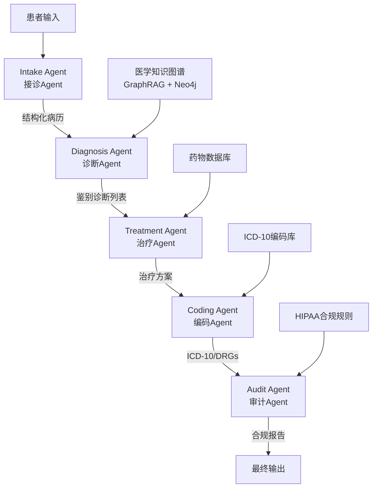

# 多Agent医疗临床辅助决策系统 - 完整项目计划

## 一、项目定位与目标

面向求职面试的企业级多Agent医疗临床辅助决策系统，提供：
- 三种语言（Python/Java/Go）的完整实现
- 从零到面试的全链路学习材料
- 详细的代码讲解 + 面试八股文 + 简历模板 + STAR法回答

---

## 二、技术调研结论

### 2.1 参考的企业级开源项目

| 项目 | 来源 | 价值 |
|------|------|------|
| Medical-Graph-RAG | ACL 2025, 750+ stars | GraphRAG医学知识图谱，三层图结构 + U-Retrieval |
| ClinicalPilot | GitHub 2026 | 多Agent辩论式推理，3个Agent对抗式讨论后达成共识 |
| multi-agent-clinical-decision-support-system | GitHub 2025 | 6个专业Agent + PubMed/OpenTargets集成 |
| Healthcare AI Clinical Decision Support | LangGraph + GPT-4o-mini | 实时风险分层 + 药物安全验证 |
| MediGenius | GitHub 2025 | 90%+准确率，完整前后端 + Docker部署 + CI/CD |
| LangGraph4j | v1.8.11, 2026 | Java版LangGraph，Spring AI集成 |
| LangGraphGo | GitHub 2025 | Go原生多Agent框架，17+预建Agent架构 |

### 2.2 技术栈选型

```
Python版: LangGraph + FastAPI + GraphRAG + PostgreSQL + Docker
Java版:   LangGraph4j + Spring Boot + Spring AI + PostgreSQL + Docker
Go版:     LangGraphGo + Gin + PostgreSQL + Docker
通用:      FHIR R4 API + Neo4j (知识图谱) + Redis (缓存) + MinIO (文件)
```

---

## 三、系统架构设计

### 3.1 五个Agent角色



### 3.2 每个Agent的详细职责

**Intake Agent（接诊Agent）**
- 患者基本信息采集（姓名、年龄、性别、联系方式）
- 主诉结构化提取（症状、持续时间、严重程度）
- 病史整理（既往病史、家族史、过敏史、用药史）
- 输出：FHIR R4格式的标准化患者资源

**Diagnosis Agent（诊断Agent）**
- 基于GraphRAG检索医学知识图谱
- 症状-疾病关联分析
- 实验室检查结果解读
- 鉴别诊断排序（概率排名）
- 输出：诊断列表 + 置信度 + 证据链

**Treatment Agent（治疗Agent）**
- 循证医学治疗方案推荐
- 药物交互检查（DDI检测）
- 剂量计算与禁忌证校验
- 非药物治疗建议
- 输出：治疗方案 + 用药清单 + 注意事项

**Coding Agent（编码Agent）**
- ICD-10自动编码（基于诊断文本NLP提取）
- DRGs分组（根据主诊断+手术+合并症）
- 编码质量自检
- 输出：ICD-10编码 + DRGs分组 + 编码依据

**Audit Agent（审计Agent）**
- HIPAA合规检查（18项PHI标识符脱敏验证）
- 全链路审计日志（who/what/when/where/why）
- RBAC访问控制验证
- 数据脱敏执行
- 输出：合规报告 + 脱敏数据 + 审计记录

---

## 四、项目目录结构

```
medical-clinical-decision-system/
├── README.md                          # 超详细README（小白友好）
├── plan.md                            # 项目计划文档
├── docs/                              # 文档目录（7篇技术文档）
│   ├── 00-项目概览.md
│   ├── 01-环境搭建指南.md
│   ├── 02-架构设计详解.md
│   ├── 03-Agent设计原理.md
│   ├── 04-GraphRAG知识图谱.md
│   ├── 05-FHIR-API集成.md
│   ├── 06-HIPAA合规设计.md
│   └── 07-部署运维指南.md
├── interview/                         # 面试准备材料（7篇）
│   ├── 01-简历写法模板.md
│   ├── 02-STAR法回答模板.md
│   ├── 03-八股文-多Agent系统.md
│   ├── 04-八股文-LangGraph核心.md
│   ├── 05-八股文-医疗AI专题.md
│   ├── 06-面试高频问题50题.md
│   └── 07-系统设计面试回答.md
├── python/                            # Python实现
│   ├── src/agents/                    # 5个Agent实现
│   ├── src/graph/                     # LangGraph Pipeline
│   ├── src/services/                  # 业务服务层
│   ├── src/models/                    # 数据模型
│   ├── src/api/                       # FastAPI接口
│   └── src/config/                    # 配置管理
├── java/                              # Java实现
│   └── src/main/java/com/medical/    # Spring Boot + LangGraph4j
├── go/                                # Go实现
│   ├── cmd/server/                    # 入口
│   └── internal/                      # Agent + Pipeline + Service
└── docker/                            # 通用Docker配置
    └── init-db.sql
```

---

## 五、核心代码实现要点

### 5.1 Python版 - LangGraph Pipeline（核心）

```python
from langgraph.graph import StateGraph, END
from .state import ClinicalState

def build_clinical_pipeline():
    workflow = StateGraph(ClinicalState)
    workflow.add_node("intake", intake_agent)
    workflow.add_node("diagnosis", diagnosis_agent)
    workflow.add_node("treatment", treatment_agent)
    workflow.add_node("coding", coding_agent)
    workflow.add_node("audit", audit_agent)

    workflow.set_entry_point("intake")
    workflow.add_edge("intake", "diagnosis")
    workflow.add_conditional_edges("diagnosis", route_diagnosis)
    workflow.add_edge("treatment", "coding")
    workflow.add_edge("coding", "audit")
    workflow.add_edge("audit", END)

    return workflow.compile()
```

### 5.2 Java版 - Spring Boot + LangGraph4j

```java
@Component
public class ClinicalPipeline {
    public ClinicalState invoke(String rawInput) {
        state = intakeAgent.process(state);
        do {
            state = diagnosisAgent.process(state);
            if (state.isNeedsMoreInfo()) state = intakeAgent.process(state);
        } while (state.isNeedsMoreInfo() && retries <= MAX_RETRIES);
        state = treatmentAgent.process(state);
        state = codingAgent.process(state);
        state = auditAgent.process(state);
        return state;
    }
}
```

### 5.3 Go版 - Gin + go-openai

```go
func (p *Pipeline) Execute(rawInput string) *model.ClinicalState {
    state = p.intakeAgent.Process(state)
    for retries < maxRetries {
        state = p.diagnosisAgent.Process(state)
        if !state.NeedsMoreInfo { break }
        state = p.intakeAgent.Process(state)
    }
    state = p.treatmentAgent.Process(state)
    state = p.codingAgent.Process(state)
    state = p.auditAgent.Process(state)
    return state
}
```

---

## 六、面试材料规划

### 6.1 简历写法（3种不同经验级别）

- **初级版**（0-1年）：强调技术实现 + 学习能力
- **中级版**（1-3年）：强调架构设计 + 性能优化
- **高级版**（3年+）：强调系统设计 + 业务价值

### 6.2 STAR法模板（覆盖5种常见场景）

- S: 医疗临床决策面临什么问题
- T: 你在项目中负责什么
- A: 你做了哪些技术决策和实现
- R: 达到了什么效果（量化指标）

### 6.3 八股文覆盖范围

- **多Agent系统核心**：Agent通信、状态管理、错误处理、并发控制（30题）
- **LangGraph专题**：State/Node/Edge、检查点、条件路由、Human-in-the-loop（20题）
- **医疗AI专题**：FHIR标准、ICD-10编码、HIPAA合规、GraphRAG（20题）
- **面试高频问题**：技术原理、系统设计、项目经验、行为面试（50题）

---

## 七、实施步骤

### 阶段一：核心实现（Python版优先）✅
1. 初始化项目结构 + Git仓库
2. 实现共享状态定义和LangGraph Pipeline
3. 逐个实现5个Agent
4. 集成FHIR/GraphRAG/ICD-10服务
5. FastAPI接口层
6. Docker化部署

### 阶段二：多语言扩展 ✅
7. Java版实现（Spring Boot + LangGraph4j）
8. Go版实现（Gin + go-openai）
9. 统一Docker Compose基础设施

### 阶段三：文档与面试材料 ✅
10. 编写超详细README.md
11. 编写docs/目录下7篇技术文档
12. 编写interview/目录下7篇面试材料
13. 上传至GitHub
